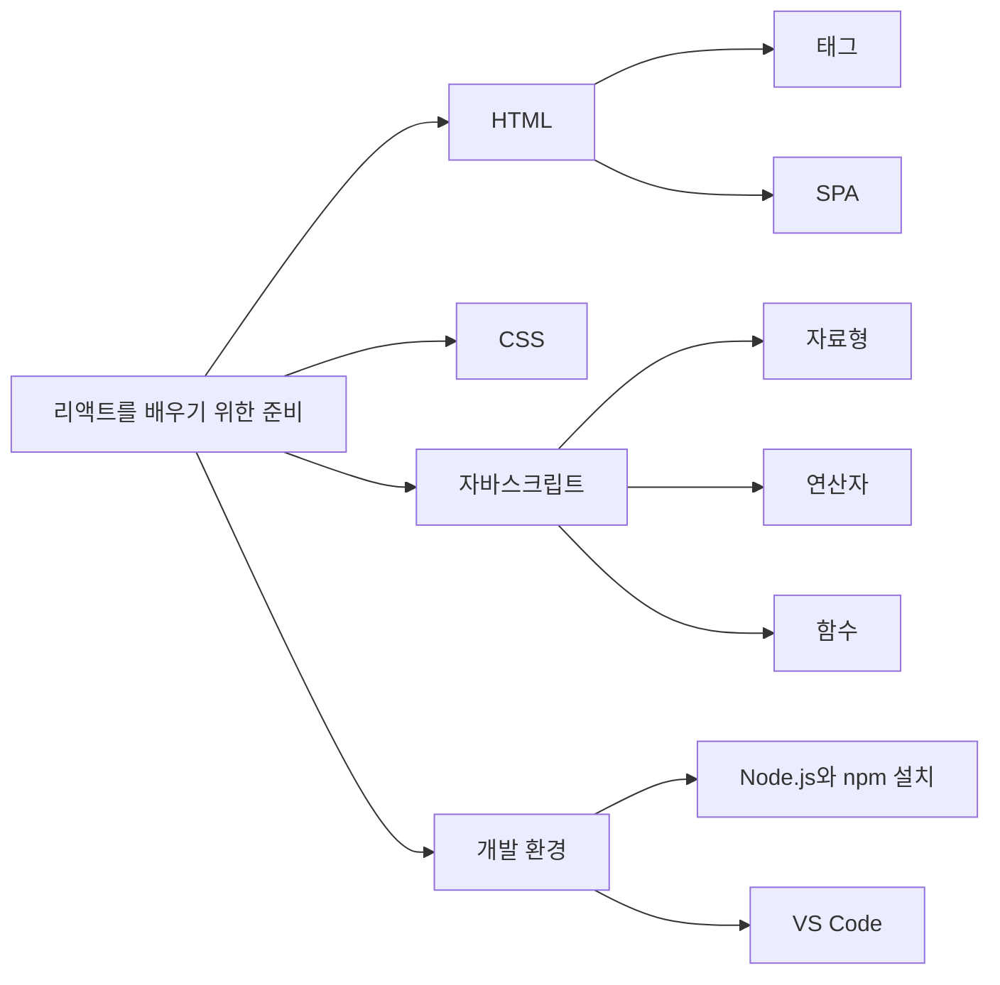
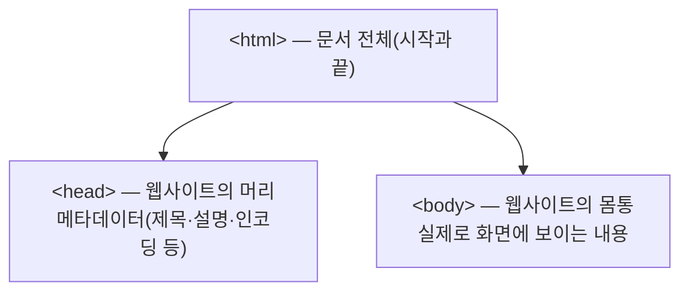
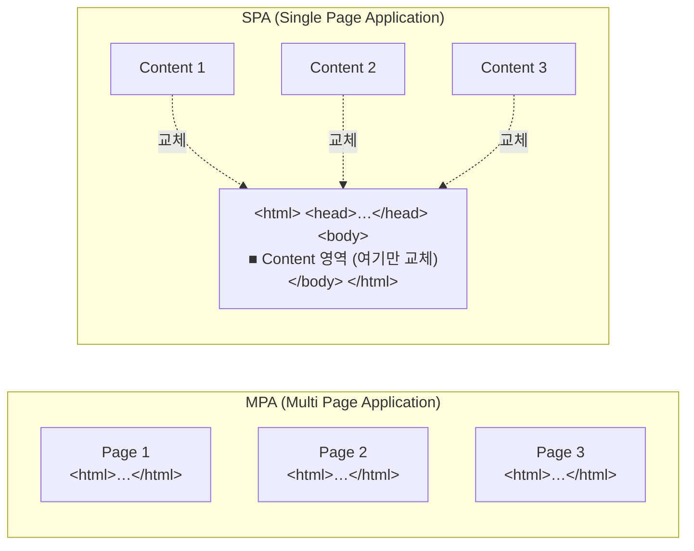

# 0장 준비하기

> 리액트를 배우기 전에 필요한 기초 지식 정리.
> HTML → CSS → 자바스크립트 → 개발 환경 순서로, "리액트를 이해하는 데 필요한 만큼만" 훑는다.

## ⏱ 30초 요약

- **HTML**은 웹사이트의 뼈대를 만드는 마크업 언어. 태그는 열었으면 반드시 닫는다 → [0.1](#01-html-살펴보기)
- **`<head>`** 는 눈에 보이지 않는 정보(메타데이터), **`<body>`** 는 실제로 보이는 내용 → [0.1 ③](#3-웹사이트의-뼈대를-구성하는-태그들)
- **SPA**는 HTML 파일 하나로 `<body>` 안의 콘텐츠만 갈아 끼우는 방식. 리액트가 이걸 도와준다 → [0.1 ④](#4-spa-single-page-application)
- **CSS**는 겉모습 담당. 같은 HTML도 CSS만 바꾸면 전혀 다른 사이트가 된다 → [0.2](#02-css란-무엇인가)
- **자바스크립트**는 동작 담당. 정식 명칭은 ECMAScript, 기준은 ES6, 동적 타이핑 언어 → [0.3](#03-자바스크립트)

> 다른 장의 요약은 [30초 요약 인덱스](README.md)에 모여 있다.

## Preview — 이 장의 지도



- **HTML**: 웹페이지의 *뼈대*
- **CSS**: 웹페이지의 *동작이 아닌 겉모습(스타일)*
- **자바스크립트**: 웹페이지에 *생명을 불어넣는* 동적인 부분
- **개발 환경**: Node.js + npm + VS Code(IDE, Integrated Development Environment)

---

## 0.1 HTML 살펴보기

### 1) HTML이란 무엇인가?

**HTML = Hyper Text Markup Language**

- 웹사이트를 구성하는 가장 기본 요소 중 하나이자 **마크업 언어**의 한 종류.
- *마크업(markup)* = 데이터나 문서를 처리하기 위해 문서에 추가되는 정보를 의미.
  즉 "이 부분은 제목", "이 부분은 문단" 같은 **정보를 표현하기 위한 언어**가 마크업 언어다.
- HTML은 주로 웹에서 사용되지만, 마크업 언어 자체는 웹 브라우저 외의 다른 곳에서도 쓰인다.
  (예: 마크다운 — 지금 읽고 있는 이 문서도 마크업 언어로 작성됨)

> 정리하면, **HTML은 웹사이트의 뼈대를 구성하기 위해 사용하는 마크업 언어**다.

### 2) 태그(tag)

HTML에서는 "부르고 싶은 것"을 **태그**로 감싼다. 태그가 곧 웹사이트의 구조를 만든다.

```html
<html>여기에 내용이 들어간다</html>
```

| 규칙 | 설명 |
| --- | --- |
| 부등호로 감싼다 | `<`, `>` 사이에 태그 이름을 넣는다 |
| 여는 태그 / 닫는 태그 | `<html>` … `</html>` 처럼 짝을 이룬다 |
| 닫는 태그에는 슬래시 | `</html>` — 이름 앞에 `/` |
| 빈 태그(self-closing) | 닫을 내용이 없으면 `<br />`처럼 열고 닫는 것을 한 번에 |

- 여는 태그만 쓰고 닫는 태그를 빠뜨리면 **오류가 발생**할 수 있으니 항상 짝을 기억할 것.
- 태그는 열었으면 꼭 닫아야 한다 — 이걸 놓쳐서 레이아웃이 깨지는 경우가 아주 흔하다.

### 3) 웹사이트의 뼈대를 구성하는 태그들

가장 기본적이고 필수적인 세 가지 태그: **`<html>`, `<head>`, `<body>`**

```html
<html>
    <head>
    </head>
    <body>
    </body>
</html>
```



#### `<html>`

- 말 그대로 **HTML의 시작과 끝**을 알리는 태그.
- 모든 웹사이트의 HTML 소스는 `<html>`로 시작하고 `</html>`로 끝난다.
- 브라우저 개발자 도구(F12)로 아무 사이트나 열어보면 실제로 확인할 수 있다.

**구글의 HTML 소스 (개발자 도구 Elements 탭)**

```html
<!DOCTYPE html>
<html itemscope itemtype="http://schema.org/WebPage" lang="en-KR">   <!-- ← 시작 -->
  <head>…</head>
  <body jsmodel="hspDDf" jsaction="…">
    …
  </body>
</html>                                                              <!-- ← 끝 -->
```

#### `<head>` — 웹사이트의 머리

사람 몸에 비유하면 이해가 쉽다.

```
      ( 머리 )   ← <head>  : 겉으로 드러나지 않지만 그 사이트가 "누구인지" 알려주는 정보
     ---------
    /         \
   |  몸  통   |  ← <body>  : 실제로 눈에 보이는 얼굴·팔·다리
    \_________/
     |  |  |  |
```

- `<head>` 안에는 **메타데이터(metadata)** 가 들어간다.
  = 웹사이트의 여러 가지 속성(제목, 설명 등)을 담고 있는 정보.
- 사람이 얼굴을 보고 누구인지 알아보듯, 브라우저와 검색엔진은 `<head>`를 보고
  **이 웹사이트가 어떤 사이트인지** 판단한다.
- 화면에 직접 보이지는 않지만, **검색 결과에 노출되는 제목과 설명**이 여기서 나온다.

```html
<!DOCTYPE html>
<html lang="ko">
<head>
    <title>소플의 블로그</title>
    <meta name="title"       content="소플의 블로그">
    <meta name="description" content="…">
    <meta charset="utf-8">
    <meta name="viewport"    content="width=device-width, initial-scale=1.0">
</head>
```

| 태그 | 역할 |
| --- | --- |
| `<title>` | 웹사이트의 제목. 브라우저 탭에 표시되고 검색 결과의 제목이 된다 |
| `<meta name="description">` | 사이트 설명. 검색 결과에서 제목 아래 문구 |
| `<meta charset="utf-8">` | 문자 인코딩. 한글이 깨지지 않게 해준다 |
| `<meta name="viewport">` | 모바일 화면 대응 |

#### `<body>` — 웹사이트의 몸통

- **실제로 우리가 화면에서 보게 되는 내용**이 전부 여기에 들어간다.
- 그래서 `<body>` 태그 안에 들어 있는 내용이 바뀌면, 우리가 보는 화면이 바뀐다.
  → **이 문장이 다음 절 SPA의 핵심 전제**다.

### 4) SPA (Single Page Application)

#### 기존 방식 — MPA (Multi Page Application)

웹사이트를 돌아다니는 과정을 생각해보자.

1. 사이트에 접속하면 첫 페이지가 나온다.
2. 버튼이나 탭을 누르면 여러 페이지를 이동한다.
3. 이동할 때마다 **화면이 통째로 깜빡이며** 새 내용이 나타난다.

즉 **페이지마다 별도의 HTML 파일이 존재하고**, 페이지를 이동할 때마다
브라우저가 해당 페이지의 HTML 파일을 새로 받아와서 화면에 통째로 표시한다.

- 페이지가 수백 개인 사이트라면? → HTML 파일도 수백 개.
- 규모가 커질수록 관리가 어렵고, 이동할 때마다 전체를 다시 그리니 느리다.

#### 해결책 — SPA (Single Page Application)

말 그대로 **하나의 페이지로 구성된 웹사이트**.



| | MPA | SPA |
| --- | --- | --- |
| HTML 파일 수 | 페이지 수만큼 여러 개 | **단 하나** |
| 페이지 이동 시 | 새 HTML을 서버에서 받아 전체 로딩 | `<body>` 안의 **콘텐츠만 교체** |
| 화면 | 이동할 때마다 깜빡임 | 깜빡임 없이 부드러움 |
| 전통/최신 | 전통적인 방식 | 현대적인 방식 |

동작 원리:

- HTML 파일은 **하나만 존재**한다. 처음에는 이 파일의 `<body>` 태그가 텅 비어 있다.
- 특정 페이지에 접속하면, 그 페이지에 해당하는 **콘텐츠를 가져와서 `<body>` 안에 채워 넣는다.**
- 다른 페이지로 이동하면 `<body>` 내용만 갈아 끼운다. 페이지 전체를 다시 받지 않으니 부드럽고 빠르다.

> **리액트는 이런 SPA를 쉽게 만들 수 있도록 도와주는 도구다.**
> 여기서는 SPA의 개념만 이해하고 넘어가고, 자세한 내용은 [1장](./ch01.md)에서 다시 다룬다.

---

## 0.2 CSS란 무엇인가?

**CSS = Cascading Style Sheets**

- 웹사이트의 **레이아웃과 디자인**(글꼴, 색상, 여백 등)을 입히는 언어.
- HTML로 웹사이트의 **구조**를 만들면, 그 위에 CSS를 사용해서 **디자인을 입혀** 아름다운 웹사이트가 완성된다.

```
   HTML (뼈대)  +  CSS (겉모습)  =  완성된 웹사이트
```

동일한 HTML 소스라도 **CSS만 바꾸면 전혀 다른 디자인**의 웹사이트가 된다.

```
┌───────────────────────┐   ┌───────────────────────┐
│ 소플의 블로그          │   │ 소플의 블로그          │
├───────────────────────┤   ├───────────────────────┤
│ (연두 배경)            │   │ (청록 배경)            │
│ 리액트에 대해서 배워볼까요? │   │ 리액트에 대해서 배워볼까요? │
├───────────────────────┤   ├───────────────────────┤
│ CSS 설정에 따라        │   │ CSS 설정에 따라        │
│ 완전 다른 모습이 됩니다. │   │ 완전 다른 모습이 됩니다. │
└───────────────────────┘   └───────────────────────┘
     같은 HTML, 다른 CSS  →  전혀 다른 웹사이트
```

- CSS는 잘 다루면 다양한 디자인을 마음대로 구현할 수 있지만, **속성이 상당히 많고 복잡**하다.
- 리액트를 배우는 지금 단계에서는 **주요 CSS 속성 몇 가지만 알아도 충분**하다.
- 스타일링은 뒤쪽(15장 스타일링)에서 다시 다루니, 여기서는 "겉모습을 담당한다" 정도로만 이해하고 넘어간다.

---

## 0.3 자바스크립트

### 1) 자바스크립트란 무엇인가?

만약 웹사이트가 HTML으로만 구성되어 있다면, 사용자는 버튼을 누르거나 정보를 입력하는 등의
**동적인 작업을 처리할 수 없다.** 그래서 이런 동작을 처리하기 위해서, 즉 웹사이트에
**생명을 불어넣어 주는** 것이 자바스크립트다.

- 자바스크립트는 **프로그래밍 언어**의 한 종류다.
- 이름 때문에 자바(Java)와 연관되어 보이지만 **완전히 다른 언어**다.
  - 자바 → 컴파일(compile) 언어. 소스코드를 해석해서 실행 가능한 형태로 변환한 뒤 실행.
  - 자바스크립트 → **인터프리터 언어(스크립트 언어)**. 코드를 한 줄씩 해석하며 바로 실행.
- *스크립트(script)* 언어란 컴파일 과정 없이 **런타임(runtime)에 해석되는** 프로그래밍 언어를 말한다.

### 2) ECMAScript와 ES6

- 자바스크립트의 정식 명칭은 **ECMAScript**다.
- ECMAScript의 앞 글자를 따서 버전을 **ES5, ES6, …** 로 부른다.
- **ES6 = ECMAScript 2015** (2015년에 발표되어서 ES2015라고도 부른다).
- 자바스크립트는 수없이 많은 변천사를 겪었고, 버전마다 고유의 기능이 추가되어 왔다.
- 2015년 ES6에서 **너무 많은 것이 바뀌어서**, 현대 자바스크립트의 사실상 기준점이 되었다.
- 이 책은 **ES6+ 문법을 기준**으로 설명한다. (최신 버전은 계속 나오고 있지만, 리액트를 하는 데 필요한 건 ES6 이후 문법)

### 3) 자바스크립트의 자료형

**자료형(data type)** = 변수에 담기는 데이터의 종류.

- 흔히 정수(integer), 배열(array) 등으로 부르는 것들이다.
- 대부분의 언어에서는 변수를 선언하는 시점에 자료형을 정해야 한다.
  ```c
  int i = 100;   // C, 자바 등 — "정수형 변수 i" 라고 미리 선언
  ```
- 하지만 자바스크립트는 **동적 타이핑(dynamic typing)** 언어다.
  변수를 선언할 때 타입을 명시하지 않고, **대입되는 값에 따라 자료형이 결정**된다.
  ```js
  var i = 100;      // 숫자
  var i = "hello";  // 같은 변수에 문자열도 가능
  ```
- 덕분에 부담 없이 쓸 수 있지만, **타입 실수로 인한 버그**가 생기기 쉽다는 단점도 있다.
  (그래서 실무에서는 TypeScript를 많이 쓴다 — 이 책 범위 밖)

주요 자료형:

| 자료형 | 예시 |
| --- | --- |
| `number` | `100`, `3.14` |
| `string` | `"hello"`, `'리액트'` |
| `boolean` | `true`, `false` |
| `undefined` | 값이 할당되지 않은 상태 |
| `null` | 값이 없음을 명시적으로 표현 |
| `object` | `{ name: "소플" }` |
| `array` | `[1, 2, 3]` |
| `function` | `function () {}` |

### 4) 자바스크립트가 쓰이는 곳

자바스크립트는 웹사이트를 위한 언어로 시작했지만, 지금은 훨씬 넓은 곳에서 쓰인다.

| 분야 | 기술 | 설명 |
| --- | --- | --- |
| 웹 프론트엔드 | React, Vue, Angular | 원래의 영역 |
| 서버 | **Node.js** | 자바스크립트를 기반으로 서버를 개발 |
| 모바일 앱 | **React Native** | iOS/안드로이드 앱을 동시에 개발 |
| 데스크톱 앱 | **Electron** | HTML/CSS/JS로 데스크톱 앱을 만드는 오픈소스 프레임워크 |

> React Native는 Meta(전 페이스북)가 만든 오픈소스 모바일 애플리케이션 프레임워크,
> Electron은 Node.js를 기반으로 데스크톱 앱을 만드는 오픈소스 프레임워크다.

---

## 0.4 개발 환경 구축

> ⚠️ 이 절은 전달받은 사진 범위 밖이라 **일반적인 내용으로 채운 부분**입니다.
> 책 본문과 대조해서 수정해 주세요. 상세 실습은 [2장](./ch02.md)에서 이어집니다.

### 1) Node.js와 npm

- **Node.js**: 브라우저 밖에서 자바스크립트를 실행할 수 있게 해주는 런타임.
  리액트 개발에 필요한 도구들(빌드 도구, 개발 서버)이 전부 Node 위에서 돌아간다.
- **npm (Node Package Manager)**: Node.js 패키지를 설치·관리하는 도구. Node.js를 설치하면 함께 설치된다.

설치 확인:

```bash
node -v   # v20.x.x 이상 권장 (LTS)
npm -v
```

- 다운로드: <https://nodejs.org> → **LTS(Long Term Support)** 버전 선택
- 이 저장소 기준: **Node.js 20 LTS 이상**

### 2) VS Code

- **IDE(Integrated Development Environment, 통합 개발 환경)** 중 하나.
- 마이크로소프트가 만든 무료 에디터로, 프론트엔드 개발에서 사실상 표준.
- 다운로드: <https://code.visualstudio.com>

추천 확장 프로그램:

| 확장 | 용도 |
| --- | --- |
| ESLint | 코드 문법·스타일 검사 |
| Prettier | 코드 자동 정렬 |
| ES7+ React/Redux snippets | 컴포넌트 코드 자동 완성 |
| Auto Rename Tag | 여는 태그 수정 시 닫는 태그 자동 반영 |

---

## 이 장에서 배운 것 / 헷갈린 것

- [x] HTML은 **뼈대**, CSS는 **겉모습**, 자바스크립트는 **동작**을 담당한다.
- [x] `<head>`는 눈에 안 보이는 정보(메타데이터), `<body>`는 눈에 보이는 내용.
- [x] **`<body>` 안의 내용만 갈아 끼우는 것이 SPA**이고, 리액트가 이걸 쉽게 만들어 준다.
- [x] 자바스크립트 ≠ 자바. 자바스크립트의 정식 명칭은 **ECMAScript**, 기준은 **ES6**.
- [ ] 헷갈린 것: SPA에서 뒤로 가기/북마크는 어떻게 동작할까? → 라우팅 개념(React Router)에서 확인 필요.

## 함께 읽을 공식 문서

| 주제 | 링크 |
| --- | --- |
| HTML 기초 | <https://developer.mozilla.org/ko/docs/Learn/HTML> |
| CSS 기초 | <https://developer.mozilla.org/ko/docs/Learn/CSS> |
| 자바스크립트 재입문 | <https://developer.mozilla.org/ko/docs/Web/JavaScript/Language_overview> |
| React 설치 | <https://ko.react.dev/learn/installation> |

---

| ← 이전 | 목차 | 다음 → |
| :--- | :---: | ---: |
| — | [30초 요약 인덱스](README.md) | [1장 리액트 소개](ch01.md) |
