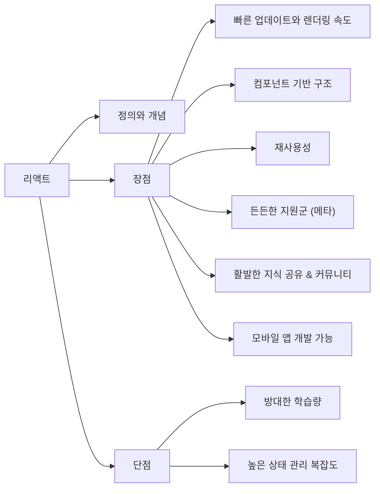
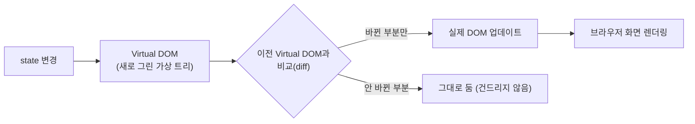
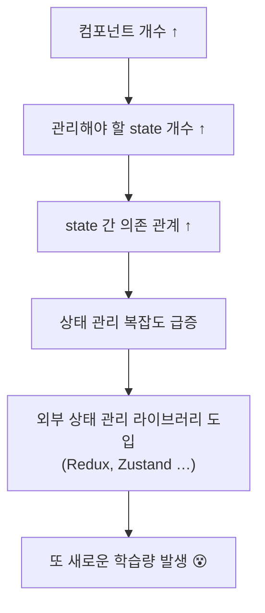

# 1장 리액트 소개

> 리액트가 **무엇인지(정의)**, **왜 쓰는지(장점)**, **무엇을 각오해야 하는지(단점)** 를 정리한다.
> 기술을 배우기 전에 그 정의와 개념을 먼저 이해해두면, 뒤에서 배울 내용이 훨씬 잘 붙는다.
> 전제가 되는 SPA 개념은 [0장 SPA](./ch00.md#4-spa-single-page-application)에서 이어진다.

## ⏱ 30초 요약

- 리액트 = **웹과 네이티브 UI를 위한 자바스크립트 라이브러리**. SPA를 쉽고 빠르게 만들어 준다 → [1.1](#11-리액트는-무엇인가)
- **라이브러리 vs 프레임워크**의 차이는 흐름의 **제어 권한을 누가 갖느냐** → [1.1 ④](#4-다양한-자바스크립트-ui-프레임워크)
- **Virtual DOM**으로 바뀐 부분만 찾아 실제 DOM에 반영 → 빠른 업데이트 → [1.2 ①](#1-빠른-업데이트와-렌더링-속도)
- 장점 6가지: 렌더링 속도 · 컴포넌트 구조 · 재사용성 · 메타의 지원 · 커뮤니티 · React Native → [1.2](#12-리액트의-장점)
- 단점 2가지: **방대한 학습량**, **높은 상태 관리 복잡도**(state가 늘수록 복잡해진다) → [1.3](#13-리액트의-단점)

> 다른 장의 요약은 [30초 요약 인덱스](README.md)에 모여 있다.

## Preview — 이 장의 지도



---

## 1.1 리액트는 무엇인가?

### 1) 리액트의 정의

리액트 공식 웹사이트의 한 줄 정의:

> **The library for web and native user interfaces**
> (웹과 네이티브 사용자 인터페이스를 위한 라이브러리)

이 짧은 문장을 이해하려면 **라이브러리**와 **사용자 인터페이스(UI)** 두 가지 개념을 먼저 알아야 한다.

### 2) 라이브러리(library)란?

**프로그래밍 언어에서 자주 사용되는 기능들을 정리해 모아 놓은 것.**

우리가 아는 "도서관"이 여러 책을 모아 정리해 놓은 곳인 것처럼,
라이브러리는 **자주 쓰는 기능을 잘 정리해서 모아 놓은 책장**에 비유할 수 있다.

```
        ┌──────────────── 라이브러리 ────────────────┐
        │  ▤▤▤▤   문자열 관련 기능                  │
        │  ▤▤▤▤   숫자 관련 기능                    │
        │  ▤▤▤▤   날짜 관련 기능                    │
        └───────────────────────────────────────────┘
        필요할 때 꺼내 쓰는 "기능 모음집"
```

### 3) 사용자 인터페이스(UI)란?

**UI = User Interface**

- *인터페이스* = 서로 다른 두 개체가 **상호작용하기 위해 중간에 있는 접점**.
- 웹사이트로 치면 **사용자와 컴퓨터 프로그램 사이의 접점**이 UI다.
- 버튼, 폼, 텍스트, 이미지 등 **화면에서 사용자와 상호작용하는 모든 것**이 UI에 해당한다.
  - 버튼을 누르면 반응이 오고, 폼에 입력하면 값이 들어간다 → 전부 UI의 영역.

> 따라서 **리액트 = 사용자 인터페이스를 만들기 위한 대표적인 자바스크립트 UI 라이브러리**다.

### 4) 다양한 자바스크립트 UI 프레임워크

웹사이트를 구축할 때 사용하는 대표적인 자바스크립트 UI 라이브러리/프레임워크는 세 가지다.

| | AngularJS | React | Vue.js |
| --- | --- | --- | --- |
| 만든 곳 | Google | Facebook → **Meta** | Evan You (개인) |
| 최초 출시 | 2010년 | 2013년 | 2014년 |
| 현재 상태 | 2022년 1월 LTS 종료 | **가장 많이 사용됨** | 꾸준히 성장 중 |

- **AngularJS**: 셋 중 가장 먼저 나왔고 한때 널리 쓰였지만, 버전 업데이트가 잦고 안정적인 버전을 장기간 유지하지 못했다. 결국 2018년의 LTS(Long Term Support) 모드마저 **2022년 1월에 종료**되었다.
- **React**: 2013년 출시 이후 사용률이 점점 증가해, **현재 가장 많이 사용되는 자바스크립트 UI 라이브러리**가 되었다.
  - 정식 명칭은 **React.js**이지만, 페이스북(현 메타)에서 만든 라이브러리라 그냥 **리액트**라고 부른다.
- **Vue.js**: 가장 최근에 나왔고, Evan You라는 개발자가 개인 프로젝트로 시작했다. 이후 영향력이 커지며 지금도 많이 사용된다.

> 기술 트렌드는 계속 바뀐다. 지금은 리액트가 대세지만 10년 뒤에는 다른 것이 표준일 수도 있다.
> **어떤 기술이든 그 근본을 공부하면서 익히면**, 새로운 기술이 나와도 빠르게 적응할 수 있다.

#### NOTE — 프레임워크와 라이브러리의 차이

| | 라이브러리 | 프레임워크 |
| --- | --- | --- |
| **제어의 주도권** | **개발자**가 가진다 | **프레임워크**가 가진다 |
| 사용 방식 | 필요할 때 내가 꺼내 쓴다 | 정해진 틀 안에서 내가 코드를 채운다 |
| 예 | React | Angular |

- 앵귤러JS와 뷰JS는 **프레임워크**, 리액트는 **라이브러리**라고 부른다.
- 가장 큰 차이점은 **흐름에 대한 제어 권한**이다.
  - 프레임워크는 흐름에 대한 제어를 **프레임워크가 갖고** 있고, 개발자가 필요한 부분만 채워 넣는다.
  - 라이브러리는 반대로 **제어를 개발자가 갖는다.** 필요할 때 내가 가져다 쓴다.

### 5) 리액트 개념 정리

지금까지의 내용을 정리하면 리액트는 **"사용자와 웹사이트의 상호작용을 돕는 인터페이스를 만들기 위한 자바스크립트 기능 모음집"** 이다.

여기에 [0장](./ch00.md)에서 배운 SPA 개념을 얹으면 리액트를 쓰는 진짜 이유가 나온다.

- 웹사이트는 HTML, CSS, 자바스크립트만으로도 만들 수 있다. **리액트가 필수는 아니다.**
- 하지만 사이트의 **규모가 커질수록 필요한 페이지 수가 많아지고**, 복잡한 사이트를 만들고 관리하기가 어려워진다.
- 규모가 큰 웹사이트는 수백 개의 페이지로 이루어지는데, 이걸 **페이지마다 각각 HTML 파일을 만들어 놓고 관리하는 것은 굉장히 비효율적이고 관리하기도 힘들다.**
- 그래서 **하나의 HTML 안에서 해당 페이지의 내용을 갈아 끼우는 SPA**가 등장했고,

> **리액트는 이런 SPA를 쉽고 빠르게 만들 수 있도록 도와주는 라이브러리다.**

---

## 1.2 리액트의 장점

### 1) 빠른 업데이트와 렌더링 속도

가장 먼저 꼽히는 장점. 리액트는 **빠른 업데이트**를 위해 내부적으로 **Virtual DOM**을 사용한다.

#### 먼저 DOM이란?

**DOM = Document Object Model (문서 객체 모델)**

- 웹페이지를 정의하는 **하나의 객체**라고 생각하면 된다.
- 브라우저 개발자 도구의 **Elements 탭**에 나오는 트리 구조, 또는 **Console 탭에서 `document`를 입력**했을 때 나오는 그것이 바로 DOM이다.
- 즉 **웹사이트의 정보를 모두 담고 있는 큰 그릇**.

```
Console > document
  ▼ #document
    <!DOCTYPE html>
    ▼ <html lang="en">
      ▶ <head>…</head>
      ▼ <body>
        ▼ <div id="__next">
            <nav>…</nav>
            <div class="grid">…</div>
          </div>
        </body>
    </html>
```

#### Virtual DOM

**Virtual DOM = 가상의 DOM**

- 리액트에서 사용하는 Virtual DOM은 이름 그대로 **가상의 DOM**이다.
- 리액트는 **웹페이지와 실제 DOM 사이에서 중간 매개체 역할**을 하는 Virtual DOM을 사용해서
  **빠른 업데이트를 가능하게 한다.**



- 실제 DOM을 통째로 다시 그리면 느리다.
- 리액트는 **가상의 DOM에서 먼저 비교해 바뀐 부분만 찾아내고**, 그 부분만 실제 DOM에 반영한다.
- → 업데이트와 렌더링이 빠르다.

> 뒤에 나오는 **state**가 바로 "무엇이 바뀌었는지"를 판단하는 기준이다.
> 이 개념은 [1.3의 단점](#2-높은-상태-관리-복잡도)에서 다시 등장한다.

### 2) 컴포넌트 기반 구조

> 📸 이 항목은 사진에 본문이 없어 요약만 적었습니다. 책 본문과 대조해 보완하세요.

- 리액트는 화면을 **컴포넌트(component)** 라는 조각 단위로 나눠서 만든다.
- 버튼 하나, 입력창 하나, 헤더 하나가 각각 독립적인 컴포넌트가 된다.
- 큰 화면을 작은 조각으로 쪼개니 **개발과 유지보수가 쉬워진다.**
- 자세한 내용은 5장(컴포넌트와 Props)에서 다룬다.

### 3) 재사용성

> 📸 이 항목도 사진 범위 밖이라 요약입니다.

- 컴포넌트로 나눠 두면 **한 번 만든 조각을 다른 곳에서 그대로 다시 쓸 수 있다.**
- 그렇게 하면 나중에 **다른 웹사이트에도 쉽고 빠르게 개발이 가능**하다.
- **재사용성이 높은 컴포넌트를 개발하는 것**이 좋은 리액트 코드를 쓰는 핵심이며,
  이 부분은 뒤에서 컴포넌트를 다룰 때 다시 자세히 설명한다.

### 4) 든든한 지원군

리액트의 또 하나의 장점으로 **든든한 지원군**을 들 수 있다.

- 리액트는 **메타(구 페이스북)가 만든 오픈소스 프로젝트**다.
- 오픈소스 프로젝트가 유지되려면 프로젝트가 **꾸준히 관리되고 유지보수되어야** 하는데,
  이는 간단한 버그를 수정하는 정도로 되는 일이 아니다. **수많은 개발자의 노력**이 필요하다.
- 자원과 인력이 없으면 오픈소스 프로젝트는 유지되기 어렵다. 그런 의미에서
  **전 세계 최대 IT 기업 중 하나인 메타가 직접 유지·발전시키는 프로젝트**라는 점은 큰 강점이다.
- 인제나 다른 새로운 라이브러리가 등장해 리액트를 쓰지 않게 되는 날이 올 수도 있지만,
  **현 시점에서는 가장 인기 있는 라이브러리**이며 메타에서 계속 발전시키고 있으므로
  **믿고 사용해도 된다.**

### 5) 활발한 지식 공유 & 커뮤니티

리액트가 지금의 위상을 가지게 된 가장 큰 이유로 **개발 생태계와 커뮤니티**를 꼽을 수 있다.

- 새로운 기술을 처음 사용하다 보면 어느 순간 **막히거나 디버깅이 안 되는 경우**가 생긴다.
- 답을 찾기 위해 여러 방법을 동원하지만, 궁금한 것에 대해 **정확한 답을 찾는 일은 쉽지 않다.**
  구글링을 해도 원하는 답을 얻기 힘든 경우가 많다.
- 그래서 **활발한 지식 공유와 활성화된 커뮤니티**는 굉장히 중요하다.
  내가 모르는 것을 바로바로 찾아볼 수 있다는 것은 **엄청난 장점**이다.

리액트의 생태계 규모를 보여주는 지표:

| 출처 | 지표 | 수치 |
| --- | --- | --- |
| **GitHub** `facebook/react` | ⭐ Star | 약 **238,000** |
| | 👁 Watch | 약 **6,700** |
| | 🍴 Fork | 약 **49,100** |
| **StackOverflow** `reactjs` 태그 | 등록된 질문 수 | 약 **480,800** |
| | 태그 watcher 수 | 약 **534,900** |

```
GitHub  facebook / react
  ┌──────────────────────────────────────────────────┐
  │  👁 Watch 6.7k   🍴 Fork 49.1k   ⭐ Starred 238k  │
  └──────────────────────────────────────────────────┘
   About: The library for web and native user interfaces
   react · javascript · library · frontend · declarative · ui
```

- **Star** = GitHub 오픈소스 프로젝트의 인기 지표. 여기서 얼마나 인기 있는지 판단.
- **Watch** = 프로젝트를 지켜보는 사람 수.
- **StackOverflow**는 개발자와 개발자 간의 질문과 답변을 주고받는 웹사이트다.
  질문 수가 많다는 것은 그만큼 **이미 누군가 물어봤고, 답이 존재할 확률이 높다**는 뜻이다.

> 굉장히 큰 개발자 풀과 잘 구축된 커뮤니티가 있으니, 개발하다 막혀도 조금만 검색하면 답을 찾을 수 있다.

### 6) 모바일 앱 개발 가능

리액트를 배운 이후에 **React Native**라는 모바일 환경 UI 프레임워크를 사용해
**모바일 앱도 개발할 수 있다.**

> **React Native — Learn once, write anywhere.**
> 하나의 코드로 Android · iOS · Windows · macOS 앱을 만든다.

- 보통 모바일 앱을 개발하려면 각 플랫폼의 언어와 프레임워크를 따로 배워야 한다.

| 플랫폼 | 기존 방식 | React Native |
| --- | --- | --- |
| Android | **Kotlin** 또는 Java | **자바스크립트 하나로** |
| iOS | **Swift** | **자바스크립트 하나로** |

- 각각의 개발 프레임워크까지 학습해야 하므로 **모바일 앱 개발의 진입 장벽이 조금 높은 편**이다.
- React Native를 사용하면 **자바스크립트로 웹사이트를 만들 듯이 모바일 앱을 만들 수 있다.**
- 물론 네이티브 앱보다 **성능이나 사용감에서 차이를 느끼는 경우도 있지만**, 간단한 수준의 앱은 충분히 만들 수 있다.
- 리액트를 배운 뒤에 React Native도 함께 학습해 보는 것을 추천.

---

## 1.3 리액트의 단점

장점만 있는 기술은 없다. 어떤 기술이든 **장점과 단점이 공존**한다.

### 1) 방대한 학습량

- 모든 라이브러리가 그렇지만, 특히 리액트는 **UI 라이브러리이기 때문에 배워야 할 것이 많다.**
- 이 책에서는 그 방대한 내용 중 **필수적이고 중요한 부분만 주제별로** 배우게 된다.
- 게다가 **한 번 배웠다고 끝나는 게 아니다.** 리액트는 계속해서 **버전 업데이트**가 이루어진다.
  새로운 내용이 계속 등장하므로, 이를 꾸준히 학습하고 숙지하고 있어야 실무에서 원활하게 작업할 수 있다.

```
React Versions
  The React docs at react.dev provide documentation for the
  latest version of React.
  ▸ Latest version: 19.1
  ▸ Previous versions …
```

> 📌 리액트도 계속해서 **버전 업데이트가 이뤄지고 있음** — 공식 문서를 1차 자료로 삼는 습관이 중요한 이유.

### 2) 높은 상태 관리 복잡도

또 다른 단점으로 **높은 상태 관리 복잡도**를 들 수 있다.

- 리액트에는 **state**라는 중요한 개념이 있다. state는 쉽게 말해 **리액트 컴포넌트의 상태**를 의미한다.
- 앞에서 Virtual DOM을 설명할 때 "**바뀐 부분만 찾아서 업데이트한다**"고 했는데,
  여기서 **바뀌는 것이 바로 state**이고, 바뀐 부분이란 곧 **state가 바뀐 컴포넌트**를 의미한다.
- 따라서 state는 리액트에서 **굉장히 중요한 역할**을 담당한다.

문제는 **규모가 커질수록** 발생한다.



- 처음엔 생각보다 쉽지 않고, 컴포넌트 개수가 많아지면 **상태 관리의 복잡도도 증가**한다.
- 그래서 보통 **큰 규모의 프로젝트에서는 상태 관리를 위해 Redux, Zustand 등 외부 상태 관리 라이브러리를 사용**한다.
- 하지만 이런 라이브러리를 사용하려면 **또 그것을 공부해야 한다**는 것이 문제다.
- 이 책은 **리액트를 배우는 것을 목표**로 하기에, 복잡하고 어려운 외부 상태 관리 라이브러리는 다루지 않는다.
- 그렇다 하더라도 이 책에서 다루는 **리액트 상태 관리의 기본 개념만 제대로 이해한다면**,
  상태 관리 복잡도에 대한 부담도 크게 줄어든다. **너무 걱정하지 말 것.**

---

## 이 장에서 배운 것 / 헷갈린 것

- [x] 리액트 = **웹과 네이티브 UI를 만들기 위한 자바스크립트 라이브러리**.
- [x] **라이브러리 vs 프레임워크**의 차이는 **흐름의 제어 권한을 누가 갖느냐**.
- [x] 리액트의 존재 이유 = **SPA를 쉽고 빠르게** 만들기 위해서.
- [x] **Virtual DOM**으로 바뀐 부분만 찾아 실제 DOM에 반영 → 빠른 업데이트.
- [x] 장점 6가지 / 단점 2가지 (특히 **state 복잡도**는 미리 각오해둘 것).
- [ ] 헷갈린 것: Virtual DOM의 "비교(diff)"는 정확히 어떤 기준으로 이뤄질까? → 4장 렌더링, 6장 State에서 확인.

## 함께 읽을 공식 문서

| 주제 | 링크 |
| --- | --- |
| 빠른 시작 | <https://ko.react.dev/learn> |
| UI 표현하기 | <https://ko.react.dev/learn/describing-the-ui> |
| 렌더링하고 커밋하기 | <https://ko.react.dev/learn/render-and-commit> |
| React 버전 히스토리 | <https://ko.react.dev/versions> |
| React Native | <https://reactnative.dev> |

---

| ← 이전 | 목차 | 다음 → |
| :--- | :---: | ---: |
| [0장 준비하기](ch00.md) | [30초 요약 인덱스](README.md) | [2장 리액트 시작하기](ch02.md) |
