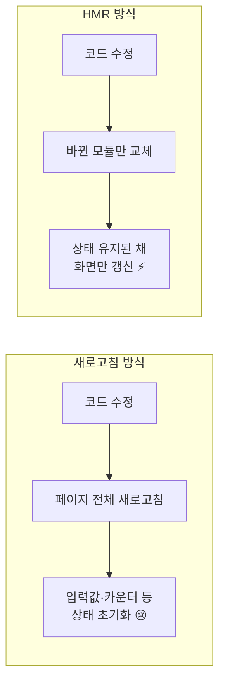
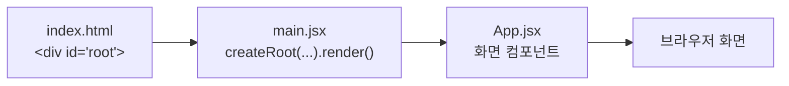

# 2장 리액트 시작하기

> 이 장에서는 **실제로 리액트 애플리케이션을 생성**해 본다.
> 앞서 배운 것처럼 HTML, CSS, 자바스크립트만으로도 웹사이트를 만들 수 있지만,
> 리액트를 사용하면 [1장에서 본 다양한 장점](./ch01.md#12-리액트의-장점)을 누릴 수 있기 때문에 리액트를 사용하는 것이다.

## ⏱ 30초 요약

- **create-react-app(CRA)** 은 리액트 19 이후 **deprecated**. 개념과 역사만 알아둔다 → [2.1](#practice-21-create-react-app으로-리액트-애플리케이션-생성하기)
- 새 프로젝트는 **Vite**로: `npm create vite@latest my-app -- --template react` → [2.2](#practice-22-vite로-리액트-애플리케이션-생성하기)
- 실행은 `cd my-app` → `npm install` → `npm run dev`, 주소는 **localhost:5173** (CRA는 3000) → [STEP 2](#step-2--패키지-설치-및-실행)
- **HMR**: 코드를 저장하면 전체 새로고침 없이 **바뀐 모듈만 교체** → 상태가 유지된다 → [NOTE](#note--hot-module-replacement-hmr)
- CRA와 Vite의 차이는 생성 명령어 · 실행 명령어 · 포트 · 진입 파일 → [비교표](#create-react-app-vs-vite-정리)

> 다른 장의 요약은 [30초 요약 인덱스](README.md)에 모여 있다.

## Preview — 이 장의 지도


> 주황 점선 영역 = **실습(PRACTICE)**
> 먼저 `create-react-app`을 사용해 리액트 애플리케이션을 생성해 보고,
> 이어서 **Vite**라는 빌드 도구를 활용해 리액트 애플리케이션을 생성하는 방법도 알아본다.

---

## PRACTICE 2.1 create-react-app으로 리액트 애플리케이션 생성하기

### create-react-app이란?

**create-react-app**은 리액트로 웹 애플리케이션을 개발하는 데 **필요한 모든 설정이 미리 구성된
프로젝트를 생성해 주는 도구**다. 이름이 길기 때문에 앞 글자를 따서 **CRA**라고 부르기도 한다.

- 리액트 **18까지는** create-react-app을 통해 리액트 애플리케이션을 생성했다.
- 하지만 리액트 **19 출시 이후에는 create-react-app이 더 이상 권장되지 않는다(deprecated).**
- 뒤에서 다룰 **Vite** 같은 최신 도구가 훨씬 더 효율적인 개발 환경을 제공하므로,
  이러한 도구를 사용하는 것이 매우 중요하다.
- 그럼에도 create-react-app은 리액트 생태계 발전 과정에서 **매우 중요한 역할을 했었기 때문에**,
  간단하게나마 사용해 보고 넘어간다.

> ⚠️ **실습용 학습 목적**. 새 프로젝트는 [2.2 Vite](#practice-22-vite로-리액트-애플리케이션-생성하기)로 만들자.

### 사전 준비

| 필요한 것 | 확인 방법 |
| --- | --- |
| **Node.js** | `node -v` |
| **npm** | `npm -v` |
| **VS Code** | 아직 설치하지 않았다면 [설치](https://code.visualstudio.com) |

모든 개발 환경이 준비되었다면 **VS Code의 터미널**에서 `create-react-app` 명령어를 실행한다.

### STEP 1 — 프로젝트 생성

```bash
# 사용법
npx create-react-app <your-project-name>

# 실제 사용 예시
npx create-react-app my-app
```

- **`npx`** 는 npm 패키지를 **다운로드와 동시에 바로 실행**해 주는 명령어다.
  패키지를 특정 위치에 설치하고 실행 파일 경로를 직접 지정해야 하는 **번거로운 과정을 생략**할 수 있어 매우 편리하다.
- **`my-app`** 부분은 **프로젝트 이름**을 의미하므로, 원하는 이름으로 자유롭게 변경해도 상관없다.

명령어를 실행했을 때 다음 메시지가 나타나면 **`y`** 를 입력해 계속 진행한다.

```text
▸ 실습 화면 01
$ npx create-react-app my-app
Need to install the following packages:
  create-react-app@5.1.0
Ok to proceed? (y)          ← y 입력
```

이후 필요한 패키지들이 **자동으로 설치되며** 리액트 애플리케이션이 생성된다.

```text
▸ 실습 화면 02
Success! Created my-app at /Users/soaple/my-app
Inside that directory, you can run several commands:

  npm start
    Starts the development server.
  npm run build
    Bundles the app into static files for production.
  npm test
    Starts the test runner.
  npm run eject
    Removes this tool and copies build dependencies, configuration files
    and scripts into the app directory. If you do this, you can't go back!

We suggest that you begin by typing:

  cd my-app
  npm start

Happy hacking!
```

프로젝트 생성이 완료되면 화면에 보이는 것처럼 **애플리케이션을 실행할 수 있는 명령어를 친절하게 안내**해 준다.

### STEP 2 — 프로젝트 실행

```bash
cd my-app
npm start
```

- **`cd`** 는 **change directory**의 약자로, 현재 커맨드 라인이 위치한 경로를 변경하는 역할을 한다.
  macOS의 Finder나 Windows의 파일 탐색기에서 **폴더를 더블 클릭해 들어가거나
  뒤로 가기 버튼을 눌러 폴더를 빠져나오는 동작**과 유사하다.
- 여기에서는 먼저 생성한 `my-app` 프로젝트 폴더 **안으로 들어간 뒤**, `npm start`로 애플리케이션을 실행한다.

```text
▸ 실습 화면 03
$ cd my-app
my-app $ npm start
```

### STEP 3 — 브라우저에서 확인

명령어를 실행하고 잠시 기다리면 **자동으로 브라우저가 열리며 `http://localhost:3000`으로 접속**된다.

- **`localhost`** 는 **현재 내가 사용 중인 컴퓨터**를 의미한다.
  즉, 리액트 애플리케이션이 **로컬 개발 환경에서 실행되고 있다**는 뜻이다.
- **`3000`** 은 CRA 개발 서버의 기본 포트 번호다.

해당 주소로 접속하면 다음과 같이 **리액트 로고가 표시된 화면**을 확인할 수 있다.

```text
▸ 실습 화면 04  (http://localhost:3000)
┌──────────────────────────────────────────┐
│                                          │
│                  ⚛                      │
│                                          │
│    Edit src/App.js and save to reload.   │
│                                          │
│               Learn React                │
│                                          │
└──────────────────────────────────────────┘
```

이렇게 create-react-app으로 간단하게 리액트 애플리케이션을 생성하고 실행해 볼 수 있다.

---

## PRACTICE 2.2 Vite로 리액트 애플리케이션 생성하기

### Vite란?

**Vite**는 리액트를 포함한 **다양한 프론트엔드 프로젝트를 더 빠르고 효율적으로 개발할 수 있도록
도와주는 빌드 도구**다.

- create-react-app과 **비슷한 역할**을 하지만, **성능 면에서 더 우수한 개발 환경**을 제공한다.
- 현재 리액트 공식 문서에서도 새 프로젝트에 권장하는 방식이다.

### STEP 1 — 프로젝트 생성

```bash
npm create vite@latest my-app -- --template react
```

명령어를 뜯어보면:

| 부분 | 의미 |
| --- | --- |
| `npm create vite@latest` | **Vite의 최신 버전**을 사용하여 프로젝트를 생성 |
| `my-app` | 생성할 **프로젝트의 이름** (원하는 이름으로 자유롭게 변경 가능) |
| `-- --template react` | **리액트 템플릿**을 사용하여 프로젝트를 생성 |

```text
▸ 실습 화면 01
$ npm create vite@latest my-app -- --template react

> create-vite my-app --template react

Scaffolding project in /Users/soaple/my-app...

Done. Now run:

  cd my-app
  npm install
  npm run dev
```

### STEP 2 — 패키지 설치 및 실행

명령어를 실행한 후에는 다음 터미널 명령어를 **순서대로** 실행하여
생성된 디렉터리로 이동하고, 필요한 패키지를 설치한 뒤, 애플리케이션을 **개발 모드로 시작**한다.

```bash
cd my-app
npm install
npm run dev
```

```text
▸ 실습 화면 02
$ cd my-app
my-app $ npm install

added 197 packages, and audited 198 packages in 11s

33 packages are looking for funding
  run `npm fund` for details

found 0 vulnerabilities
```

`npm run dev` 명령어를 실행하면 **Vite가 개발 서버를 시작**하며,
애플리케이션이 **실행 중인 주소가 포함된 메시지**가 터미널에 출력된다.

```text
▸ 실습 화면 03
  VITE v7.x.x  ready in 283 ms

  ➜  Local:   http://localhost:5173/
  ➜  Network: use --host to expose
  ➜  press h + enter to show help
```

### STEP 3 — 브라우저에서 확인

이제 브라우저에서 **`http://localhost:5173`** 로 접속하면
Vite가 생성한 리액트 애플리케이션을 확인할 수 있다.

```text
▸ 실습 화면 04  (http://localhost:5173)
┌──────────────────────────────────────────────────┐
│                  ⚡  +  ⚛                        │
│                                                  │
│                 Vite + React                     │
│                                                  │
│                  ┌───────────┐                   │
│                  │ count is 0│                   │
│                  └───────────┘                   │
│     Edit src/App.jsx and save to test HMR        │
│                                                  │
│   Click on the Vite and React logos to learn more│
└──────────────────────────────────────────────────┘
```

참고로 Vite는 **빠른 개발 서버**와 **Hot Module Replacement(HMR)** 를 지원하므로
**코드를 변경할 때 즉시 결과를 확인할 수 있다**는 장점이 있다.

#### NOTE — Hot Module Replacement (HMR)

> 개발 중 코드가 변경되었을 때 **전체 페이지를 새로 고치지 않고 변경된 모듈만 교체**하여
> 즉시 반영하는 기능이다.
> 따라서 **상태를 유지한 채 빠르게 결과를 확인**할 수 있어 개발 효율과 생산성이 크게 향상된다.



---

## create-react-app vs Vite 정리

| | create-react-app (CRA) | **Vite** |
| --- | --- | --- |
| 생성 명령어 | `npx create-react-app my-app` | `npm create vite@latest my-app -- --template react` |
| 실행 명령어 | `npm start` | `npm run dev` |
| 기본 포트 | `http://localhost:3000` | `http://localhost:5173` |
| 진입 파일 | `src/App.js` | `src/App.jsx` |
| 패키지 설치 | 생성 시 자동 | 생성 후 `npm install` 필요 |
| 개발 서버 속도 | 느린 편 | **빠름** |
| HMR | 지원(느림) | **지원(즉시 반영)** |
| 현재 상태 | **deprecated (권장 X)** | **권장** |

---

## 생성된 프로젝트는 어떻게 굴러가는가

명령어로 만들어진 프로젝트의 파일들은 이렇게 이어진다.



- [0장에서 배운 SPA](./ch00.md#4-spa-single-page-application) 구조가 여기서 실제로 보인다.
  **HTML 파일은 `index.html` 하나뿐**이고, 그 안의 `<div id="root">`에 리액트가 내용을 채워 넣는다.
- 리액트 18부터 진입점은 `ReactDOM.render()`가 아니라 **`createRoot()`** 다. (책의 설명과 다른 부분)

---

## 이 장에서 배운 것 / 헷갈린 것

- [x] `create-react-app`은 리액트 19 이후 **deprecated**. 개념과 역사만 알아두고, 실제로는 **Vite**를 쓴다.
- [x] `npx` = 패키지를 **설치와 동시에 실행**해 주는 명령어.
- [x] `localhost` = **내 컴퓨터**. CRA는 **3000**번, Vite는 **5173**번 포트.
- [x] **HMR** 덕분에 코드를 저장하면 **상태를 유지한 채** 즉시 화면이 갱신된다.
- [ ] 헷갈린 것: `npm create vite@latest my-app -- --template react`에서 `--`가 두 번 나오는 이유는?
      → 앞의 `--`는 **npm이 아니라 뒤에 오는 create-vite에 옵션을 넘긴다**는 구분자.

## 책과 최신 React의 차이 메모

| 책의 설명 | 이 저장소 / 최신 React |
| --- | --- |
| `create-react-app`도 함께 실습 | Vite만 사용 (CRA는 개념만) |
| CRA의 `src/App.js` | Vite의 `src/App.jsx` |
| `npm start` | `npm run dev` |
| 포트 3000 | 포트 5173 |

## 함께 읽을 공식 문서

| 주제 | 링크 |
| --- | --- |
| React 설치하기 | <https://ko.react.dev/learn/installation> |
| React 프로젝트 시작하기 | <https://ko.react.dev/learn/start-a-new-react-project> |
| Vite 시작하기 | <https://ko.vite.dev/guide/> |
| Vite 설정 레퍼런스 | <https://ko.vite.dev/config/> |
| @vitejs/plugin-react (HMR) | <https://github.com/vitejs/vite-plugin-react> |

---

| ← 이전 | 목차 | 다음 → |
| :--- | :---: | ---: |
| [1장 리액트 소개](ch01.md) | [30초 요약 인덱스](README.md) | 3장 JSX (예정) |
