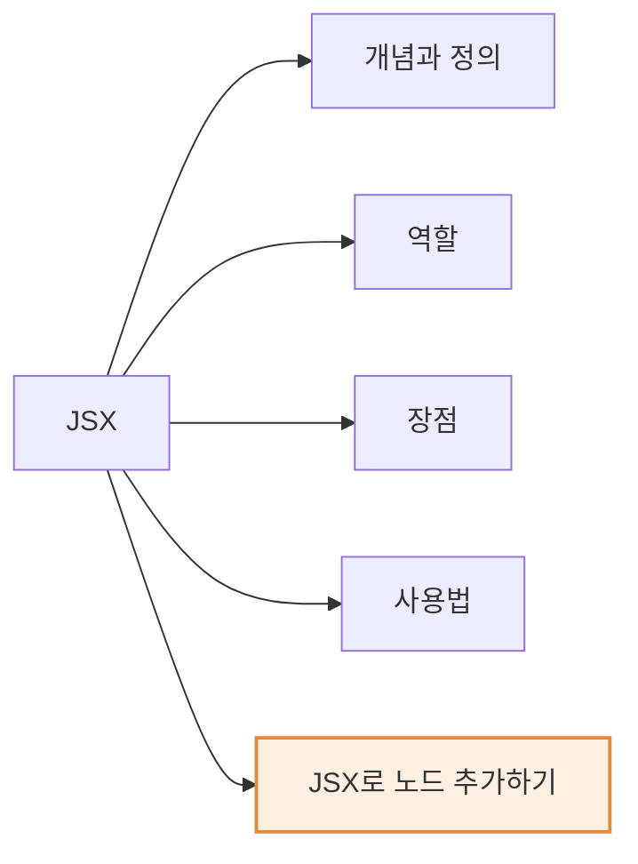
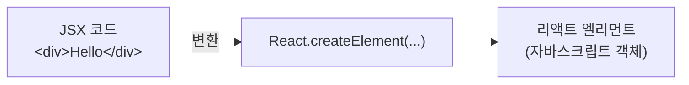
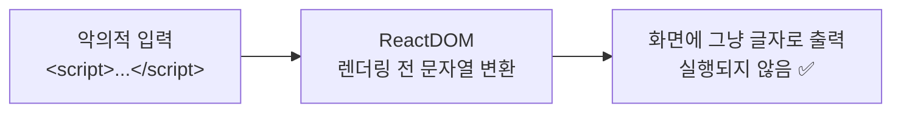

# 3장 JSX

> 이 장에서는 **JSX**에 대해서 배워 본다.
> JSX는 리액트를 사용하여 개발할 때 거의 **필수적으로 사용**하게 된다.
> 그렇기 때문에 이 장에서 JSX의 개념을 꼭 확실하게 이해하고 넘어가야 한다.

## ⏱ 30초 요약

- **JSX = JavaScript + XML/HTML**. 자바스크립트의 **확장 문법**(A syntax extension to JavaScript) → [3.1](#31-jsx란)
- JSX는 결국 **`React.createElement()` 호출로 변환**된다. 즉 최종 결과물은 자바스크립트 → [3.2](#32-jsx의-역할)
- 장점 3가지: **코드 간결 · 가독성 향상 · Injection Attack(XSS) 방어** → [3.3](#33-jsx의-장점)
- HTML 사이에 **중괄호 `{}`** 를 쓰면 그 안은 무조건 **자바스크립트 코드**(변수 · 함수 호출 · 속성값) → [3.4](#34-jsx-사용법)
- 상위 태그가 하위 태그를 감싸면 그게 곧 **children** → [3.4 children 정의하기](#children-정의하기)

> 다른 장의 요약은 [30초 요약 인덱스](README.md)에 모여 있다.

## Preview — 이 장의 지도



> 주황 영역 = **실습(PRACTICE)**
> 개념 → 역할 → 장점 → 사용법 순으로 정리한 뒤, 마지막에 JSX로 직접 노드를 추가해 본다.

---

## 3.1 JSX란?

자바스크립트를 줄여서 보통 **JS**라고 표기한다. 자바스크립트 관련 라이브러리도 이름 뒤에 `js`가 붙어서
자바스크립트 라이브러리라는 것을 나타내기도 한다. 우리가 배울 리액트도 사실 공식 명칭은 **ReactJS**다.
리액트 공식 홈페이지 주소는 지금은 <https://react.dev>로 바뀌었지만, 과거에는 <https://reactjs.org>였다.
JSX를 보면 뒤에 자바스크립트와 연관이 있을 것 같아 보이고, 실제로도 그렇다.

> **A syntax extension to JavaScript.**
> — 자바스크립트의 **확장 문법**

JSX는 **JavaScript**와 **XML/HTML**을 합친 것이다. JSX의 **X는 extension**이며,
풀어 쓰면 **JavaScript and XML/HTML**이 된다.

| 글자 | 뜻 |
| --- | --- |
| **JS** | JavaScript |
| **X** | XML / HTML (eXtension) |

가장 간단한 JSX 코드 예제를 보자.

```jsx
const element = <h1>Hello, world!</h1>;
```

- 대입 연산자 `=`의 **왼쪽**에는 `const`로 선언한 변수 `element`가 있다.
- 대입 연산자 `=`의 **오른쪽**에는 **HTML의 `<h1>` 태그**가 나온다.
- 결과적으로 이 코드는 **자바스크립트 코드와 HTML 코드가 결합된 JSX 코드**이며,
  `<h1>` 태그로 둘러싸인 문자열을 `element`라는 변수에 저장하는 역할을 한다.

JSX를 모르는 상태에서 보면 굉장히 이상한 문법처럼 느껴질 수 있다.
하지만 앞으로 리액트를 배우면서 이런 JSX 코드가 계속 나오기 때문에 곧 익숙해진다.

---

## 3.2 JSX의 역할

JSX는 **내부적으로 XML/HTML 코드를 자바스크립트로 변환하는 과정**을 거친다.
그렇기 때문에 실제로 JSX로 코드를 작성해도 **최종적으로는 자바스크립트 코드가 나오게 된다.**

여기에서 JSX 코드를 자바스크립트 코드로 변환하는 역할을 하는 것이 바로
리액트의 **`createElement()`** 라는 함수다.
엘리먼트(element)라는 개념은 [4장](./ch04.md#41-엘리먼트에-대해-알아보기)에서 자세히 배우므로,
여기에서는 `createElement()`의 **역할에만** 주목한다.



### JSX로 작성한 코드

```jsx
class Hello extends React.Component {
    render() {
        return <div>Hello {this.props.toWhat}</div>;
    }
}

const root = ReactDOM.createRoot(document.getElementById('root'));
root.render(<Hello toWhat="World" />);
```

- `Hello`라는 이름을 가진 **리액트 컴포넌트**가 나오고, 컴포넌트 내부에서
  자바스크립트 코드와 HTML 코드가 결합된 **JSX를 사용**하고 있다.
- 이렇게 만들어진 컴포넌트를 `ReactDOM.createRoot()`로 만든 `root`의 **`render()`** 함수로
  실제 화면에 렌더링한다.

### JSX 없이 작성한 코드 (변환된 결과)

```js
class Hello extends React.Component {
    render() {
        return React.createElement('div', null, `Hello ${this.props.toWhat}`);
    }
}

const root = ReactDOM.createRoot(document.getElementById('root'));
root.render(React.createElement(Hello, { toWhat: 'World' }, null));
```

> 📸 책 093~095쪽은 사진이 없어 본문을 그대로 옮기지 못했다.
> 위 코드는 실습 파일 [`hello.js`](../my-app/src/chapters/ch03/study-jsx/hello.js)에 옮겨 둔 것을 기준으로 정리했다.

**JSX의 꺾쇠 부분만 `React.createElement()` 호출로 바뀐다**는 점이 핵심이다.
비교용 JSX 원본은 [`hello.jsx`](../my-app/src/chapters/ch03/study-jsx/hello.jsx)에 있다.

> ⚠️ **책과 최신 React의 차이**
> 책은 `class ... extends React.Component`로 설명하지만, 지금은 **함수 컴포넌트**가 권장된다.
> 위 코드를 함수 컴포넌트로 바꾸면 이렇게 된다.
>
> ```jsx
> function Hello({ toWhat }) {
>     return <div>Hello {toWhat}</div>;
> }
> ```

---

## 3.3 JSX의 장점

리액트로 개발할 때 JSX를 사용하는 것이 **필수는 아니다.**
하지만 JSX를 사용했을 때 얻을 수 있는 **장점이 많기 때문에** 사용하는 것을 권장한다.

### 1) 코드가 간결해진다

| | 코드 |
| --- | --- |
| **JSX 사용함** | `<div>Hello, {name}</div>` |
| **JSX 사용 안 함** | ``React.createElement('div', null, `Hello, ${name}`);`` |

- 두 코드는 **모두 동일한 역할**을 한다.
- JSX를 사용한 코드는 HTML의 `<div>` 태그를 사용해서 `name`이라는 변수가 들어간 문장을 표현한다.
- JSX를 사용하지 않은 경우, 리액트의 `createElement()` 함수를 사용하여 동일한 작업을 수행한다.
  이때 `createElement()`의 파라미터인 **type, props, children**을 모두 직접 써 줘야 한다.
- 따로 설명하지 않아도 **어느 쪽이 더 간결한지** 바로 알 수 있다.

### 2) 가독성이 향상된다

- 위 예제에서 JSX를 사용한 코드가 그렇지 않은 코드에 비해 **코드의 의미가 훨씬 빠르게 와닿는다.**
- 가독성은 코드를 **작성할 때뿐만 아니라 유지 보수 관점에서도** 굉장히 중요하다.
  가독성이 좋으면 코드를 이해하기 쉽고, **버그도 쉽게 발견**할 수 있기 때문이다.

### 3) Injection Attack을 방어한다 (보안성)

**Injection Attack**은 쉽게 말해서 **입력창에 문자나 숫자 같은 일반적인 값이 아닌 소스코드를 입력하여
해당 코드가 실행되도록 만드는 해킹 방법**이다.
예를 들어 아이디를 입력하는 입력창에 자바스크립트 코드를 넣었는데
그 코드가 그대로 실행되어 버리면 큰 문제가 생긴다.

```jsx
const title = response.potentiallyMaliciousInput;
// 이 코드는 안전합니다.
const element = <h1>{title}</h1>;
```

- `title`이라는 변수에 **잠재적으로 보안 위험이 있는 코드가 삽입**되어 있다.
- 그리고 아래 JSX 코드에서는 `title` 변수를 `<h1>` 태그 사이에 **임베딩(embedding)** 하고 있다.
- 기본적으로 **ReactDOM은 렌더링하기 전에 임베딩된 값을 모두 문자열로 변환**한다.
  그렇기 때문에 **명시적으로 선언되지 않은 값은 삽입되지 않는다.**
- 결과적으로 **XSS(cross-site-scripting attacks)** 라 불리는 크로스 사이트 스크립팅 공격을 방어할 수 있다.



---

## 3.4 JSX 사용법

기본적으로 JSX는 **자바스크립트 문법을 확장시킨 것**이기 때문에 **모든 자바스크립트 문법을 지원**한다.
여기에 추가로 **XML과 HTML을 섞어서** 사용하면 된다.

### 변수 사용하기

```jsx
const name = '소플';
const element = <h1>안녕, {name}</h1>;

const root = ReactDOM.createRoot(document.getElementById('root'));
root.render(element);
```

- XML/HTML 코드를 작성하다가 중간에 **자바스크립트 코드를 사용하고 싶으면 중괄호 `{}` 로 묶어 주면 된다.**
- `{name}`으로 표시된 부분이 바로 `name`이라는 **자바스크립트 변수를 참조**하기 위해 중괄호를 사용한 것이다.

→ 실습: [`name.jsx`](../my-app/src/chapters/ch03/study-jsx/name.jsx)

### 함수 호출하기

```jsx
function formatName(user) {
    return user.firstName + ' ' + user.lastName;
}

const user = {
    firstName: 'Inje',
    lastName: 'Lee',
};

const element = (
    <h1>
        Hello, {formatName(user)}
    </h1>
);

const root = ReactDOM.createRoot(document.getElementById('root'));
root.render(element);
```

- HTML 코드 사이에 중괄호를 사용해서 **변수가 아닌 `formatName()`이라는 자바스크립트 함수를 호출**하고 있다.
- 이런 식으로 XML/HTML 코드 사이에 중괄호를 사용해서 **자바스크립트 변수나 함수**를 사용하면 된다.

```jsx
function getGreeting(user) {
    if (user) {
        return <h1>Hello, {formatName(user)}!</h1>;
    }
    return <h1>Hello, Stranger.</h1>;
}
```

- 사용자 이름에 따라 **다른 인사말을 표시**하는 코드다.
- 사용자가 존재하면 `formatName()`으로 포매팅된 이름을 출력하고,
  그렇지 않은 경우 `Stranger`에게 인사말을 출력한다.

→ 실습: [`formatName.jsx`](../my-app/src/chapters/ch03/study-jsx/formatName.jsx)

### 어트리뷰트(attribute)에 값 넣기

HTML 태그 **중간이 아닌 태그의 속성(attribute)** 에 값을 넣고 싶을 때는 두 가지 방법이 있다.

```jsx
// 큰따옴표 사이에 문자열을 넣거나
const element = <div tabIndex="0"></div>;

// 중괄호 사이에 자바스크립트 코드를 넣으면 됨!
const element = </img>;
```

> 💡 **JSX에서 중괄호를 사용하면 무조건 자바스크립트 코드가 들어간다**고 생각하면 된다.
> 이 규칙은 [5장 Props 사용법](./ch05.md#3-props-사용법)에서도 그대로 이어진다.

### children 정의하기

```jsx
const element = (
    <div>
        <h1>안녕하세요</h1>
        <h2>열심히 리액트를 공부해 봅시다!</h2>
    </div>
);
```

- 평소에 HTML을 사용하듯이 **상위 태그가 하위 태그를 둘러싸도록 하면 자연스럽게 children이 정의**된다.
- 여기에서 `<div>` 태그의 children은 **`<h1>` 태그와 `<h2>` 태그**가 된다.

```text
<div>                    ← 부모
 ├─ <h1>안녕하세요</h1>          ← children[0]
 └─ <h2>열심히 ...</h2>         ← children[1]
```

이처럼 JSX를 사용하면 **간단하고 직관적으로** 코드를 작성할 수 있으며 **가독성도 높아진다.**

→ 실습: [`element.jsx`](../my-app/src/chapters/ch03/study-jsx/element.jsx)

---

## PRACTICE 3.5 JSX로 노드 추가하기

> 📸 책의 실습 페이지는 사진이 없다. 아래 내용은 저장소에 작성해 둔 실습 코드를 기준으로 정리했다.

책 정보를 표시하는 `Book` 컴포넌트를 만들고, `Library` 컴포넌트가 이를 여러 번 사용한다.

### JSX로 작성한 버전

```jsx
function Book(props) {
    return (
        <div>
            <h1>{`이 책의 이름은 ${props.name}입니다.`}</h1>
            <h2>{`이 책은 총 ${props.numOfPages}페이지로 이뤄져 있습니다.`}</h2>
        </div>
    );
}

export default Book;
```

→ [`Book.jsx`](../my-app/src/chapters/ch03/Book.jsx)

### JSX 없이 작성한 버전

```jsx
import React from 'react';

function BookJS(props) {
    return React.createElement(
        'div',
        null,
        [
            React.createElement('h1', null, `이 책의 이름은 ${props.name}입니다.`),
            React.createElement('h2', null, `이 책은 총 ${props.numOfPages}페이지로 이뤄져 있습니다.`)
        ]
    );
}

export default BookJS;
```

→ [`BookJS.jsx`](../my-app/src/chapters/ch03/BookJS.jsx)

두 파일을 나란히 놓고 보면 [3.3의 첫 번째 장점](#1-코드가-간결해진다)이 바로 체감된다.

### 여러 번 사용하기

```jsx
import Book from './Book.jsx';

function Library(props) {
    return (
        <div>
            <Book name="처음 만난 파이썬" numOfPages={300} />
            <Book name="처음 만난 AWS" numOfPages={400} />
            <Book name="처음 만난 리액트" numOfPages={500} />
        </div>
    );
}

export default Library;
```

→ [`Library.jsx`](../my-app/src/chapters/ch03/Library.jsx)

- 문자열은 `"..."`, 숫자는 `{300}`처럼 **중괄호**로 넣는다. ([5장에서 다시 나온다](./ch05.md#3-props-사용법))
- 같은 `Book` 컴포넌트에 **다른 값을 넣어 서로 다른 화면**을 만들어 내는 것 —
  이것이 [5장 컴포넌트와 Props](./ch05.md#5장-컴포넌트와-props)의 핵심 개념으로 이어진다.

---

## 이 장에서 배운 것 / 헷갈린 것

- [x] **JSX = JavaScript + XML/HTML**. 자바스크립트의 확장 문법이며 X는 **extension**.
- [x] JSX는 필수가 아니다. 하지만 **`React.createElement()`를 직접 쓰는 것보다 훨씬 간결·명확**하다.
- [x] JSX는 **컴파일 시점에 `React.createElement()` 호출로 변환**된다 → 최종 결과물은 자바스크립트.
- [x] **중괄호 `{}` = 자바스크립트 영역**. 변수, 함수 호출, 어트리뷰트 값 모두 여기에 들어간다.
- [x] ReactDOM이 임베딩 값을 **문자열로 변환**하므로 **XSS를 기본으로 방어**한다.
- [ ] 헷갈린 것: `<h1>Hello, {formatName(user)}</h1>`처럼 **텍스트와 `{표현식}`이 섞이면 children은 어떻게 되나?**
      → **배열**이 된다. ([4장 Tick 예제 주석](../my-app/src/chapters/ch04-elementRendering/study/Tick.jsx)에 정리해 뒀다)
- [ ] 헷갈린 것: 책은 `ReactDOM.createRoot()`를 전역 `ReactDOM`으로 쓰는데, Vite에서는 왜 안 되나?
      → 책은 **CDN 전역 스크립트** 기준이다. Vite에서는 `import { createRoot } from 'react-dom/client'`로
      **모듈을 직접 import** 해야 한다.

## 책과 최신 React의 차이 메모

| 책의 설명 | 최신 React |
| --- | --- |
| `class Hello extends React.Component` | **함수 컴포넌트** 권장 |
| 전역 `React` · `ReactDOM` 사용 (CDN) | `import { createRoot } from 'react-dom/client'` |
| `React.createElement` 를 쓰려면 `React` import 필요 | **JSX만 쓴다면 `import React` 불필요** (React 17+ 새 JSX 변환) |

## 함께 읽을 공식 문서

| 주제 | 링크 |
| --- | --- |
| JSX로 마크업 작성하기 | <https://ko.react.dev/learn/writing-markup-with-jsx> |
| 중괄호가 있는 JSX 안에서 자바스크립트 사용하기 | <https://ko.react.dev/learn/javascript-in-jsx-with-curly-braces> |
| `createElement` | <https://ko.react.dev/reference/react/createElement> |
| JSX 변환 (React 17 릴리스 노트) | <https://ko.legacy.reactjs.org/blog/2020/09/22/introducing-the-new-jsx-transform.html> |

---

| ← 이전 | 목차 | 다음 → |
| :--- | :---: | ---: |
| [2장 리액트 시작하기](ch02.md) | [30초 요약 인덱스](README.md) | [4장 엘리먼트 렌더링](ch04.md) |
