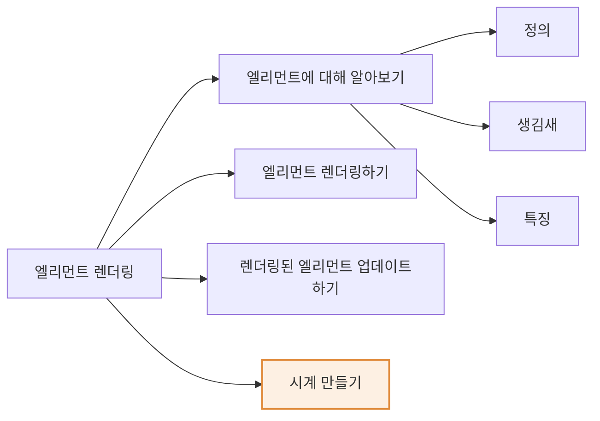
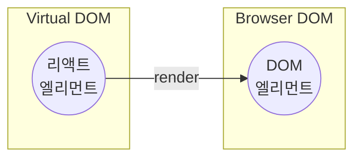
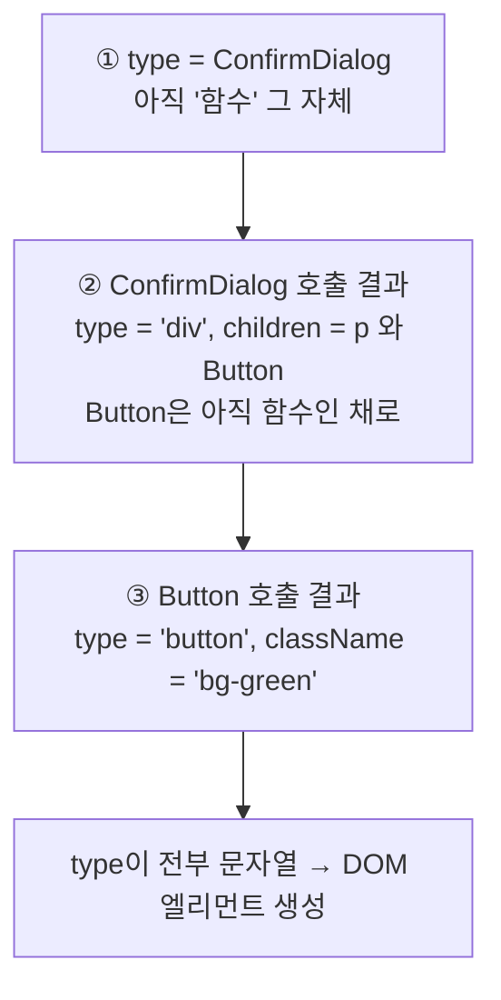
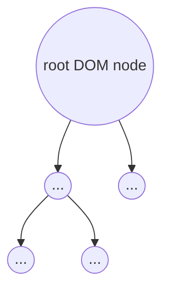
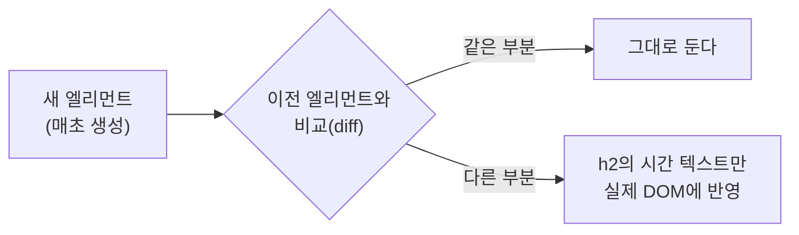

# 4장 엘리먼트 렌더링

> 이 장에서는 리액트의 **엘리먼트(element)** 라는 개념에 대해서 배워 본다.
> 이미 [3장에서 리액트의 `createElement()`](./ch03.md#32-jsx의-역할) 함수에 대해 배웠다.
> `createElement()`는 **이름 그대로 엘리먼트를 생성해 주는 함수**다.
> 그렇다면 엘리먼트가 어떤 것이고 어떤 역할을 하는지 잘 알고 있어야 한다.
> 이 장에서 엘리먼트의 **개념과 역할, 엘리먼트가 렌더링되는 과정**에 대해 자세히 알아본다.

## ⏱ 30초 요약

- **엘리먼트 = 리액트 앱을 구성하는 가장 작은 빌딩 블록.** 화면에 보일 내용을 **기술(describe)** 한다 → [4.1 ①](#1-엘리먼트의-정의)
- **리액트 엘리먼트(Virtual DOM) ≠ DOM 엘리먼트(브라우저 DOM).** 전자는 후자의 **가상 표현**이다 → [4.1 ①](#1-엘리먼트의-정의)
- 엘리먼트는 `type` · `props`(그 안에 `children`)를 가진 **평범한 자바스크립트 객체**다 → [4.1 ②](#2-엘리먼트의-생김새)
- 렌더링은 **`createRoot(root DOM node).render(element)`**. HTML에는 `<div id="root">` 하나만 있으면 된다 → [4.2](#42-엘리먼트-렌더링하기)
- 엘리먼트는 **불변(immutable)**. 업데이트하려면 **새로 만들어 바꿔치기**한다 → [4.3](#43-렌더링된-엘리먼트-업데이트하기)

> 다른 장의 요약은 [30초 요약 인덱스](README.md)에 모여 있다.

## Preview — 이 장의 지도



> 주황 영역 = **실습(PRACTICE)**

---

## 4.1 엘리먼트에 대해 알아보기

### 1) 엘리먼트의 정의

**Element**라는 영단어는 **요소, 성분**이라는 뜻을 갖고 있다.
어떤 물체를 구성하는 성분을 영어로 엘리먼트라고 부른다.
마찬가지로 **리액트 엘리먼트는 리액트 앱을 구성하는 요소**를 의미한다.

> **Elements are the smallest building blocks of React apps.**
> — 엘리먼트는 리액트 앱의 **가장 작은 빌딩 블록들**이다.

엘리먼트는 원래 **웹사이트에 대한 모든 정보를 담고 있는 객체인
DOM(Document Object Model)에서 사용하는 용어**다.
그래서 기존에는 엘리먼트라고 하면 **DOM 엘리먼트**를 의미했다.

크롬 브라우저의 개발자 도구에서 **Elements 탭**을 누르면 다음과 같은 화면이 나온다.

```text
▸ 크롬 개발자 도구의 Elements 탭
<!DOCTYPE html>
<html lang="en">
 ▸ <head>...</head>
 ▾ <body>
     <noscript>You need to enable JavaScript to run this app.</noscript>
   ▾ <div id="root">
     ▾ <div>                                         == $0
       ▾ <div>
           <h1>이 책의 이름은 처음 만난 파이썬입니다.</h1>
           <h2>이 책은 총 300페이지로 이뤄져 있습니다.</h2>
         </div>
       ▾ <div>
           <h1>이 책의 이름은 처음 만난 AWS입니다.</h1>
           <h2>이 책은 총 400페이지로 이뤄져 있습니다.</h2>
         </div>
       ...
```

- 탭 이름부터 **Elements**로 되어 있기 때문에 엘리먼트를 모아 놓은 것임을 알 수 있다.
- 하지만 여기에 보이는 엘리먼트는 **리액트 엘리먼트가 아니라 DOM 엘리먼트**이며,
  **HTML 요소**를 나타낸다. 실제로 우리가 화면에서 볼 수 있는 것이다.

그렇다면 **리액트 엘리먼트와 DOM 엘리먼트는 어떤 차이가 있을까?**

리액트가 개발되기 시작한 아주 초창기에 리액트 엘리먼트는
화면에 나타나는 내용을 **'describe(기술하다)'** 에서 파생된 **descriptor**라는 이름으로 불렸다.
하지만 **간결성**을 위해서 최종적으로 **엘리먼트**라고 부르기로 결정되었다.



| | 리액트 엘리먼트 | DOM 엘리먼트 |
| --- | --- | --- |
| 사는 곳 | **[Virtual DOM](./ch01.md#1-빠른-업데이트와-렌더링-속도)** | 실제 **브라우저의 DOM** |
| 정체 | 화면에 보일 내용을 **기술한 객체** | 실제로 화면에 그려지는 것 |
| 무게 | **가볍다** | 많은 정보를 담고 있어 **무겁다** |
| 변경 | **불변(immutable)** | 변경 가능 |

결국 **리액트 엘리먼트는 DOM 엘리먼트의 가상 표현**이라고 볼 수 있다.
리액트 엘리먼트는 화면에서 보이는 것을 **기술**하고,
엘리먼트가 기술한 내용을 토대로 실제 화면에서 보게 되는 **DOM 엘리먼트를 만든다.**

> 📝 이 책에서 앞으로 그냥 **"엘리먼트"** 라고 하면 **리액트 엘리먼트**를 의미한다.

### 2) 엘리먼트의 생김새

[3장에서 봤던 코드](./ch03.md#31-jsx란)를 다시 보자.

```jsx
const element = <h1>Hello, world</h1>;
```

- 이 코드가 실행될 때, 대입 연산자(`=`)의 **오른쪽 부분은 리액트의 `createElement()` 함수를 사용하여
  엘리먼트를 생성**하게 된다.
- 리액트는 이 엘리먼트를 이용해서 **실제 화면에서 보게 될 DOM 엘리먼트를 생성**한다.

**리액트 엘리먼트는 자바스크립트 객체 형태로 존재한다.**
엘리먼트는 **컴포넌트 유형(예: `Button`)** 과 **속성(예: `color`)** 및
**내부의 모든 자식(children)** 에 대한 정보를 포함하고 있는 **일반적인 자바스크립트 객체**다.
그리고 이 객체는 **마음대로 변경할 수 없는 불변성(immutable)** 을 갖고 있다.

```js
{
    $$typeof: Symbol(react.element),  // "React 엘리먼트임"을 표시하는 내부 필드
    type: 'h1',
    key: null,
    ref: null,
    props: {
        children: 'Hello, World'      // 자식은 props.children 안에 들어간다
    }
}
```

→ 실습 메모: [`element.jsx`](../my-app/src/chapters/ch04-elementRendering/study/element.jsx)

#### type이 HTML 태그 이름(문자열)인 경우

```js
{
    type: 'button',
    props: {
        className: 'bg-green',
        children: {
            type: 'b',
            props: {
                children: 'Hello, element!'
            }
        }
    }
}
```

- 버튼을 나타내기 위한 엘리먼트다. **단순한 자바스크립트 객체**임을 알 수 있다.
- `type`에 **HTML 태그 이름이 문자열로 들어가는 경우**, 엘리먼트는
  **해당 태그 이름을 가진 DOM Node**를 나타내고 `props`는 **속성**을 나타낸다.
- 이 엘리먼트가 실제로 렌더링되면 아래와 같은 DOM 엘리먼트가 된다.

```html
<button class="bg-green">
    <b>
        Hello, element!
    </b>
</button>
```

→ 실습 메모: [`Button(Element).jsx`](../my-app/src/chapters/ch04-elementRendering/study/Button%28Element%29.jsx)

#### type이 리액트 컴포넌트인 경우

```js
{
    type: Button,
    props: {
        color: 'green',
        children: 'Hello, element!'
    }
}
```

- `type`에 **HTML 태그 이름이 아닌 리액트 컴포넌트**가 들어갔다.
  이런 엘리먼트를 **컴포넌트 엘리먼트(Component Element)** 라고 부른다.
- 다른 점은 단지 **`type`에 컴포넌트의 이름이 들어갔다**는 것뿐이다.

#### 이 객체를 만들어 주는 것이 `createElement()`

```js
React.createElement(
    type,
    [props],
    [...children]
)
```

| 파라미터 | 설명 |
| --- | --- |
| **`type`** | **HTML 태그 이름(문자열)** 또는 **리액트 컴포넌트**가 들어간다. 모든 리액트 컴포넌트는 자식 컴포넌트를 모두 쪼개서 보면 **결국 HTML 태그가 나온다.** |
| **`props`** | 지금은 그냥 **엘리먼트의 속성**이라고 생각하면 된다. HTML의 `class`, `style` 같은 **attributes보다 좀 더 상위에 있는 개념**이다. ([5장에서 제대로 배운다](./ch05.md#52-props에-대해-알아보기)) |
| **`children`** | **해당 엘리먼트의 자식 엘리먼트들**이 들어간다. |

#### createElement()가 동작하는 과정

```jsx
function Button(props) {
    return (
        <button className={`bg-${props.color}`}>
            <b>
                {props.children}
            </b>
        </button>
    );
}

function ConfirmDialog(props) {
    return (
        <div>
            <p>내용을 확인하셨으면 확인 버튼을 눌러주세요.</p>
            <Button color="green">확인</Button>
        </div>
    );
}
```

`ConfirmDialog` 컴포넌트가 `Button` 컴포넌트를 포함하고 있다.
`<ConfirmDialog />`가 만드는 엘리먼트는 **`type`이 전부 문자열이 될 때까지** 아래 과정을 반복한다.



```js
// ① <ConfirmDialog /> 가 만드는 엘리먼트 — type이 아직 함수 그 자체
{ type: ConfirmDialog, props: {} }

// ② React가 ConfirmDialog(props)를 호출한 결과
{
    type: 'div',
    props: {
        children: [
            { type: 'p', props: { children: '내용을 확인하셨으면 확인 버튼을 눌러주세요.' } },
            { type: Button, props: { color: 'green', children: '확인' } }   // 아직 함수인 채로!
        ]
    }
}

// ③ React가 Button({ color: 'green', children: '확인' })을 호출한 결과
{
    type: 'button',
    props: {
        className: 'bg-green',
        children: { type: 'b', props: { children: '확인' } }
    }
}
```

> **이 반복 과정이 곧 렌더링이다.**

→ 실습 메모: [`ComponentElement.jsx`](../my-app/src/chapters/ch04-elementRendering/study/ComponentElement.jsx)

### 3) 엘리먼트의 특징

> 📸 책 118~121쪽은 사진이 없다. 아래는 [②의 불변성 설명](#2-엘리먼트의-생김새)과
> [4.3](#43-렌더링된-엘리먼트-업데이트하기)에서 확인된 내용만 정리한 것이다. 추후 보완이 필요하다.

- 리액트 엘리먼트는 **불변성(immutable)** 을 갖는다.
- **한 번 생성된 엘리먼트의 자식이나 속성은 변경할 수 없다.**
- 따라서 화면의 내용을 바꾸려면 **엘리먼트를 새로 만들어서 바꿔치기**해야 한다.
  → 이 이야기가 [4.3](#43-렌더링된-엘리먼트-업데이트하기)으로 이어진다.

---

## 4.2 엘리먼트 렌더링하기

엘리먼트를 생성한 이후에 **실제로 화면에 보여 주기 위해서는 렌더링이라는 과정**을 거쳐야 한다.
먼저 아래의 간단한 HTML 코드 하나를 보자.

```html
<div id="root"></div>
```

- `root`라는 `id`를 가진 `<div>` 태그다. 굉장히 단순하다.
- 단순하지만 이것은 **모든 리액트 앱에 들어가는 아주 중요한 코드**다.
  이것을 **root DOM node**라고 부른다.
- 실제로 이 `<div>` 태그 **안에 리액트 엘리먼트들이 렌더링**되며,
  이 `<div>` 태그 안에 있는 **모든 것이 React DOM에 의해서 관리**되기 때문이다.
- **오직 리액트만으로 만들어진 웹사이트**는 단 하나의 root DOM node를 가진다.
  반면에 **기존에 있던 웹사이트에 추가적으로 리액트를 연동**하면
  **여러 개의 분리된 root DOM node**를 가질 수도 있다.



> Virtual DOM 그림에서 **가장 최상단에 있는 동그라미가 바로 root DOM node**다.

### root `<div>`에 리액트 엘리먼트 렌더링하기

```jsx
const element = <h1>안녕, 리액트!</h1>;
const root = ReactDOM.createRoot(document.getElementById('root'));
root.render(element);
```

1. **엘리먼트를 하나 생성**한다.
2. 생성된 엘리먼트를 **root div에 렌더링**한다.
   렌더링을 위해 `ReactDOM`의 **`createRoot()`** 함수로 만든 `root`의 **`render()`** 함수를 사용한다.
   - **`render()`** — 파라미터로 받은 리액트 엘리먼트를 **root DOM node에 렌더링**하는 역할을 한다.

여기서 다시 한번 **리액트의 엘리먼트와 HTML의 엘리먼트는 다른 개념**이라는 것을 유의하자.
리액트의 엘리먼트는 **Virtual DOM**에 존재하는 것이고,
HTML 엘리먼트는 **실제 브라우저의 DOM**에 존재하는 것이다.

> 결국 **리액트 엘리먼트가 렌더링되는 과정은
> Virtual DOM에서 실제 DOM으로 이동하는 과정**이라고 할 수 있다.

→ 실습 메모: [`ElementRendering.jsx`](../my-app/src/chapters/ch04-elementRendering/study/ElementRendering.jsx)

---

## 4.3 렌더링된 엘리먼트 업데이트하기

한 번 렌더링된 엘리먼트를 업데이트하려면 어떻게 해야 할까?
앞에서 이야기한 것처럼 **리액트 엘리먼트는 불변성**을 갖는다.
**엘리먼트는 한 번 생성되면 바꿀 수 없기 때문에, 업데이트하기 위해서는 다시 생성해야 한다.**

```jsx
function tick() {
    const element = (
        <div>
            <h1>안녕, 리액트!</h1>
            <h2>현재 시간: {new Date().toLocaleTimeString()}</h2>
        </div>
    );

    const root = ReactDOM.createRoot(document.getElementById('root'));
    root.render(element);
}

setInterval(tick, 1000);
```

- `tick()` 함수는 **현재 시간을 포함한 엘리먼트를 생성하여 root div에 렌더링**하는 역할을 한다.
- 자바스크립트의 **`setInterval()`** 함수를 사용해서 `tick()` 함수를 **매초 호출**하고 있다.
- 내부적으로는 `tick()`이 호출될 때마다 **기존 엘리먼트를 변경하는 것이 아니라
  새로운 엘리먼트를 생성해서 바꿔치기**하는 것이다.

```text
▸ 실행 결과 (http://localhost:5173)
┌────────────────────────────────┐
│  안녕, 리액트!                   │
│  현재 시간: 오후 6:31:57         │  ← 매초 이 부분만 반짝인다
└────────────────────────────────┘
```

크롬의 개발자 도구를 통해서 보면 **갱신되는 부분만 반짝거린다.**
매초 새로운 엘리먼트가 생성되어 기존 엘리먼트와 교체되고,
**변경된 내용이 바뀌고 변경된 부분에 반짝이는 효과**가 나타난다.

> **리액트 엘리먼트의 불변성 때문에, 엘리먼트를 업데이트하려면 새로 만들어야 한다**는
> 중요한 사실을 꼭 기억하자.

→ 실습 메모: [`Tick.jsx`](../my-app/src/chapters/ch04-elementRendering/study/Tick.jsx)

> ⚠️ **책과 최신 React의 차이 — `createRoot()`는 한 번만 호출해야 한다**
> 위 코드는 `tick()` 안에서 **매초 `createRoot()`를 새로 호출**한다.
> React 18부터는 같은 컨테이너에 `createRoot()`를 반복 호출하면 **경고가 발생**한다.
> `createRoot()`는 **한 번만** 호출하고, 그 `root`의 `render()`만 반복해야 한다.
>
> ```jsx
> const root = createRoot(document.getElementById('root'));   // 한 번만!
> setInterval(() => root.render(<Clock />), 1000);
> ```

---

## PRACTICE 4.4 시계 만들기

> 📸 책의 실습 페이지는 사진이 없다. 아래 내용은 저장소에 작성해 둔 실습 코드를 기준으로 정리했다.

`tick()`의 내용을 **컴포넌트로 분리**한 버전이다.

```jsx
function Clock(props) {
    return (
        <div>
            <h1>안녕, 리액트!</h1>
            <h2>현재 시간: {new Date().toLocaleTimeString()}</h2>
        </div>
    );
}

export default Clock;
```

→ [`Clock.jsx`](../my-app/src/chapters/ch04-elementRendering/Clock.jsx)

렌더링 쪽은 **`createRoot()`를 한 번만 호출**하고 `render()`만 반복한다.

```jsx
const root = createRoot(document.getElementById('root'));

setInterval(() => {
    root.render(
        <StrictMode>
            <Clock />
        </StrictMode>
    );
}, 1000);
```

### 왜 화면 전체가 다시 그려지지 않는가



**매초 새 엘리먼트 트리를 통째로 만들어도**, React DOM은 **이전 엘리먼트와 비교해서
실제로 바뀐 부분(`<h2>`의 시간 텍스트)만** 실제 DOM에 반영한다.
[1장에서 배운 Virtual DOM의 장점](./ch01.md#1-빠른-업데이트와-렌더링-속도)이 여기서 실제로 동작하는 것이다.

### 지금 방식의 한계 (앞으로 배울 것)

`setInterval`로 바깥에서 계속 `render()`를 호출하는 것은 **이 장까지 배운 도구만으로 만든 임시 방편**이다.
**6장 State와 생명주기**를 배우면 컴포넌트가 **스스로 시간을 갱신**하게 만들 수 있다.

```jsx
// 미리 보기 — Hook 버전
import { useEffect, useState } from 'react';

function Clock() {
    const [now, setNow] = useState(new Date());

    useEffect(() => {
        const id = setInterval(() => setNow(new Date()), 1000);
        return () => clearInterval(id);   // 정리(cleanup)
    }, []);

    return (
        <div>
            <h1>안녕, 리액트!</h1>
            <h2>현재 시간: {now.toLocaleTimeString()}</h2>
        </div>
    );
}
```

---

## 이 장에서 배운 것 / 헷갈린 것

- [x] 엘리먼트 = **리액트 앱의 가장 작은 빌딩 블록**. 화면에 보일 내용을 **기술**한다.
- [x] **리액트 엘리먼트(Virtual DOM)** 는 **DOM 엘리먼트(브라우저 DOM)** 의 **가벼운 가상 표현**이다.
- [x] 엘리먼트는 `$$typeof` · `type` · `key` · `ref` · `props`를 가진 **평범한 객체**이며 **불변**이다.
- [x] `type`이 **문자열**이면 DOM Node, **함수(컴포넌트)** 면 컴포넌트 엘리먼트.
      **`type`이 전부 문자열이 될 때까지 함수를 호출해 펼치는 과정이 렌더링**이다.
- [x] 렌더링은 `createRoot(root DOM node).render(element)`. **root DOM node는 보통 하나**다.
- [x] 업데이트 = **새 엘리먼트로 교체**. 그래도 실제 DOM은 **바뀐 부분만** 갱신된다.
- [ ] 헷갈린 것: JSX에서 텍스트와 `{표현식}`이 섞이면 `children`이 **문자열인가 배열인가?**
      → **배열**이다. `현재 시간: {new Date()...}` → `children: ['현재 시간: ', '10:23:45']`
- [ ] 헷갈린 것: `props`와 `attributes`는 같은 것인가?
      → 아니다. **`props`가 더 상위 개념**이고, HTML의 `class`/`style` 같은 attributes는 그 일부다.

## 책과 최신 React의 차이 메모

| 책의 설명 | 최신 React |
| --- | --- |
| `tick()` 안에서 **매초 `createRoot()` 호출** | `createRoot()`는 **한 번만**, `render()`만 반복 |
| 전역 `ReactDOM.createRoot(...)` (CDN) | `import { createRoot } from 'react-dom/client'` |
| `setInterval` + 반복 `render()`로 화면 갱신 | **`useState` + `useEffect`** 로 컴포넌트가 스스로 갱신 |

## 함께 읽을 공식 문서

| 주제 | 링크 |
| --- | --- |
| 렌더링하고 커밋하기 | <https://ko.react.dev/learn/render-and-commit> |
| `createRoot` | <https://ko.react.dev/reference/react-dom/client/createRoot> |
| `root.render` | <https://ko.react.dev/reference/react-dom/client/createRoot#root-render> |
| `createElement` | <https://ko.react.dev/reference/react/createElement> |
| UI 트리로서 이해하기 | <https://ko.react.dev/learn/understanding-your-ui-as-a-tree> |

---

| ← 이전 | 목차 | 다음 → |
| :--- | :---: | ---: |
| [3장 JSX](ch03.md) | [30초 요약 인덱스](README.md) | [5장 컴포넌트와 Props](ch05.md) |
