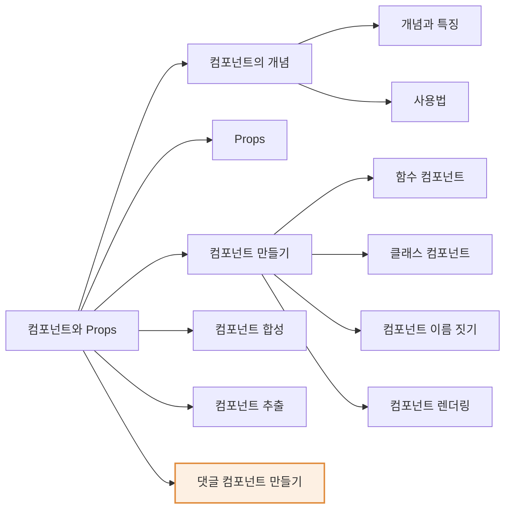
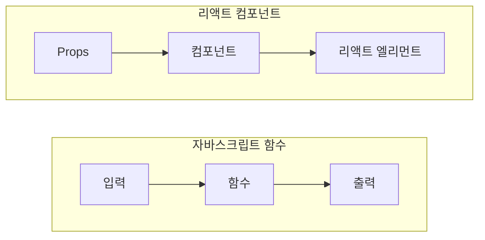
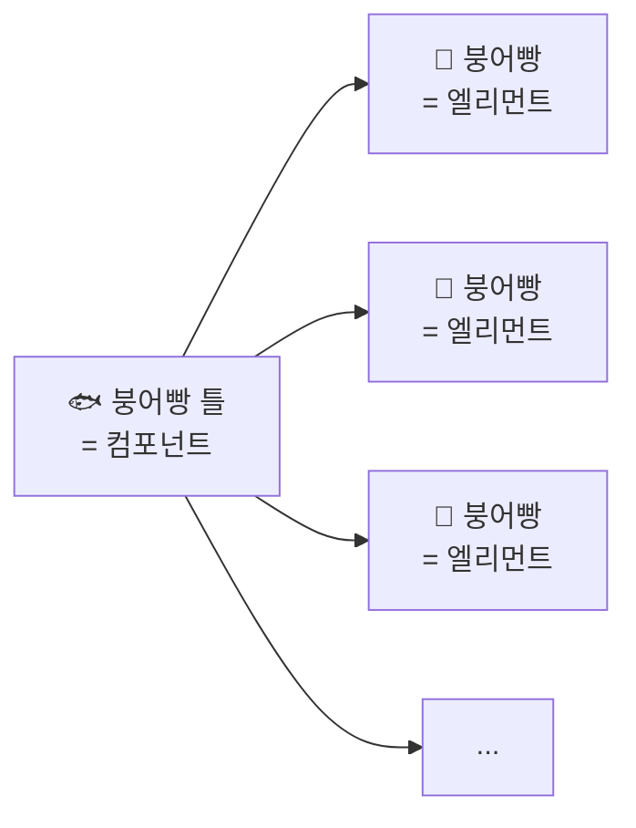
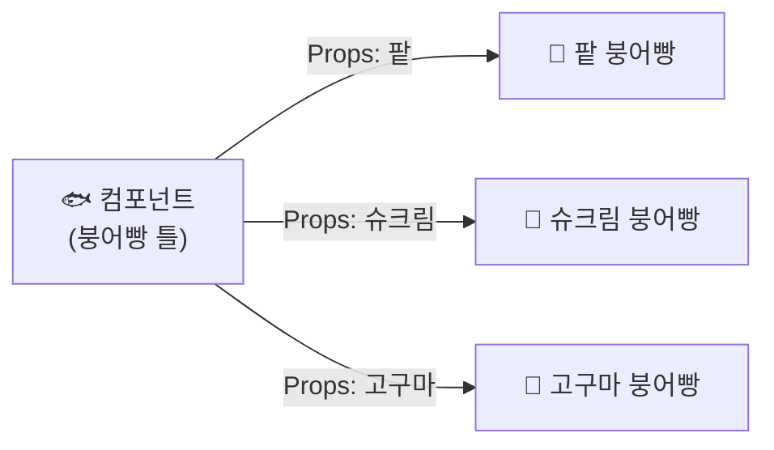
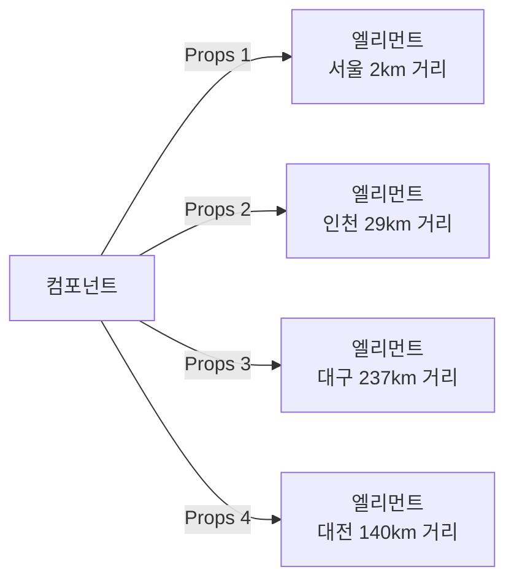
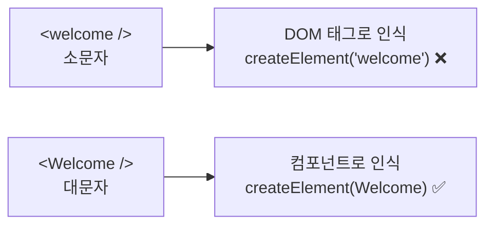
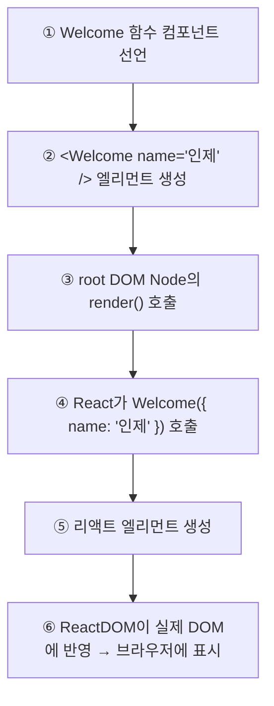

# 5장 컴포넌트와 Props

> 이 장에서는 리액트에서 **가장 중요한 부분 중 하나인 컴포넌트(Component)와 Props**에 대해서 배운다.
> 다시 한번 말하지만 이 장은 굉장히 중요한 부분이기 때문에 **완벽하게 이해하고 넘어가야** 한다.
> 만약 이해가 잘 안 되는 부분이 있다면 **이해가 될 때까지 반복적으로 다시 읽으면서** 학습하는 것을 추천한다.

## ⏱ 30초 요약

- 리액트는 **컴포넌트 기반(Component-Based)**. 작은 컴포넌트가 모여 페이지 전체를 구성한다 → [5.1](#51-컴포넌트에-대해-알아보기)
- 컴포넌트는 **함수**와 같다. **입력 = props, 출력 = [리액트 엘리먼트](./ch04.md#1-엘리먼트의-정의)** → [5.1](#51-컴포넌트에-대해-알아보기)
- **props는 읽기 전용(Read-Only)**. 모든 컴포넌트는 props에 관해 **Pure 함수처럼** 동작해야 한다 → [5.2 ②](#2-props의-특징)
- **컴포넌트 이름은 반드시 대문자로 시작**한다. 소문자면 리액트가 **DOM 태그로 인식**한다 → [5.3 ④](#4-컴포넌트-이름-짓기)
- 여러 컴포넌트를 합치면 **합성**, 큰 컴포넌트를 쪼개면 **추출**. 쪼갤수록 **재사용성**이 올라간다 → [5.4](#54-컴포넌트-합성) · [5.5](#55-컴포넌트-추출)

> 다른 장의 요약은 [30초 요약 인덱스](README.md)에 모여 있다.

## Preview — 이 장의 지도



> 주황 영역 = **실습(PRACTICE)**

---

## 5.1 컴포넌트에 대해 알아보기

[1장에서 리액트의 특징](./ch01.md#12-리액트의-장점)을 설명할 때 컴포넌트 이야기가 잠깐 나왔다.
리액트에서는 **모든 페이지가 컴포넌트로 구성**되어 있고,
**하나의 컴포넌트는 또 다른 여러 개의 컴포넌트의 조합**으로 구성될 수 있다.
그리고 이러한 컴포넌트들을 마치 **레고 블록을 조립하듯이 끼워 맞춰서** 새로운 컴포넌트를 만들 수 있다.

```text
▸ 에어비앤비 웹사이트의 컴포넌트 구조
┌──────────────────────────────────────────────┐
│  ┌────────┐ ┌────────┐ ┌────────┐ ┌────────┐ │
│  │   A    │ │   A    │ │   A    │ │   A    │ │  ← 같은 컴포넌트를 반복 사용
│  └────────┘ └────────┘ └────────┘ └────────┘ │
│  ┌───────────────────┐ ┌───────────────────┐ │
│  │         B         │ │         B         │ │  ← 또 다른 컴포넌트
│  └───────────────────┘ └───────────────────┘ │
└──────────────────────────────────────────────┘
```

- **A로 표시된 부분과 B로 표시된 부분**이 각각의 리액트 컴포넌트다.
- 이러한 컴포넌트를 **여러 개 반복적으로 사용해서 하나의 페이지를 구성**하고 있다.
- 리액트를 **컴포넌트 기반(Component-Based)** 이라고 부르는 것은,
  이렇게 작은 컴포넌트들이 모여서 하나의 컴포넌트를 구성하고,
  또 이러한 컴포넌트들이 모여서 **전체 페이지를 구성**하기 때문이다.
- 이렇게 하나의 컴포넌트를 반복적으로 사용함으로써
  **전체 코드의 양이 줄어 자연스레 개발 시간과 유지 보수 비용도 줄일 수 있다.**

### 컴포넌트는 함수와 비슷하다

리액트 컴포넌트는 **개념적으로 자바스크립트의 함수와 비슷**하다.
함수가 입력을 받아서 출력을 내뱉는 것처럼, 리액트 컴포넌트도 **입력을 받아서 정해진 출력을 내뱉는다.**
하지만 리액트 컴포넌트의 입력과 출력은 일반적인 자바스크립트 함수와는 조금 다르다.



| | 입력 | 출력 |
| --- | --- | --- |
| 자바스크립트 함수 | 파라미터 | 리턴값 |
| **리액트 컴포넌트** | **props** | **[리액트 엘리먼트](./ch04.md#1-엘리먼트의-정의)** |

> 결국 리액트 컴포넌트가 해 주는 역할은
> **어떠한 속성들을 입력으로 받아서 그에 맞는 리액트 엘리먼트를 생성하여 리턴해 주는 것**이다.

### 붕어빵 틀 비유



- 붕어빵 기계에는 **붕어 모양의 틀이 여러 개** 있고, 반죽을 부어서 붕어빵을 만든다.
- 이것은 **리액트 컴포넌트로부터 엘리먼트가 만들어지는 과정과 비슷**하다.
  - **리액트 컴포넌트** = **붕어빵 틀**
  - **각 붕어빵** = **리액트 엘리먼트**
- 소프트웨어 공학의 **객체 지향(object oriented)** 을 아는 독자라면 눈치챘겠지만,
  이 과정은 **클래스와 인스턴스의 개념과 비슷**하다.
  리액트 컴포넌트는 객체 지향까지는 아니지만 **비슷한 개념을 가지고 있다.**

---

## 5.2 Props에 대해 알아보기

### 1) Props의 개념

**props**는 `prop` 뒤에 **복수형을 나타내는 `s`** 를 붙인 것으로, prop이 여러 개인 것을 의미한다.
그럼 **prop**은 무엇일까? prop은 **property**라는 단어를 줄여서 쓴 것이다.
property는 '재산'이라는 뜻도 갖고 있지만 **'속성'** 이라는 뜻도 있다.
그렇다면 무엇의 속성일까? 바로 **리액트 컴포넌트의 속성**이다.



- 리액트 컴포넌트가 **붕어빵 틀**이라면, **props는 붕어빵에 들어가는 재료**를 의미한다.
- 팥을 넣으면 팥 붕어빵, 슈크림을 넣으면 슈크림 붕어빵, 고구마를 넣으면 고구마 붕어빵이 된다.
- **같은 붕어빵 틀에서 구워져서 모양은 같지만 안에 들어 있는 재료는 다르다.**
- 이처럼 **props는 같은 리액트 컴포넌트에서 눈에 보이는 형태를 다르게 만들어 준다.**
  props를 **컴포넌트의 속 재료**라고 생각하면 된다.

#### 실제 예 — 에어비앤비의 여행지 카드

| | `image` | `color` (HEX) | `title` | `distance` |
| --- | --- | --- | --- | --- |
| 엘리먼트 1 | `서울.jpg` | `de3151` | 서울 | 2 |
| 엘리먼트 2 | `인천.jpg` | `cc2d4a` | 인천 | 29 |
| 엘리먼트 3 | `대구.jpg` | `d93b30` | 대구 | 237 |
| 엘리먼트 4 | `대전.jpg` | `bc1a6e` | 대전 | 140 |



- 네 개의 여행지 카드는 **모두 모서리가 둥근 사각형** 모양에, 상단에는 그림이 배경으로 들어가 있고
  하단에는 색이 깔린 배경과 글자가 들어가 있는 **동일한 형태**다.
- 하지만 **그림과 색상, 글자, 거리는 모두 다르다.** 이 다른 부분이 바로 **props**다.
- 이러한 **컴포넌트의 모습과 속성을 결정하는 것이 바로 props**이며,
  props는 **컴포넌트에 전달할 다양한 정보를 담고 있는 자바스크립트 객체**다.

### 2) Props의 특징

> **props의 가장 중요한 특징은 읽기 전용(Read-Only)** 이라는 것이다.
> 읽기 전용이라는 것은 **값을 변경할 수 없다**는 말이다.

props의 값은 **리액트 컴포넌트가 엘리먼트를 생성하기 위해서 사용하는 값**이다.
그런데 이 값들이 **엘리먼트를 생성하는 도중에 갑자기 바뀌어 버리면 제대로 된 엘리먼트가 생성될 수 없다.**
마치 **붕어빵이 다 구워진 이후에 속 재료를 바꿀 수 없는 것**과 마찬가지다.
다 구워진 이후에 속 재료를 바꾸려면 **붕어빵을 새로 만들어야 한다.**

> 그렇다면 다른 props 값으로 엘리먼트를 만들려면?
> **새로운 값을 컴포넌트에 전달하여 새로 엘리먼트를 생성**하면 된다.
> 이 과정에서 **새로운 엘리먼트가 다시 렌더링**된다.
> ([4.3 렌더링된 엘리먼트 업데이트하기](./ch04.md#43-렌더링된-엘리먼트-업데이트하기)와 같은 이야기다)

#### Pure 함수와 Impure 함수

```js
// pure 함수
// input을 변경하지 않으며 같은 input에 대해서 항상 같은 output을 리턴
function sum(a, b) {
    return a + b;
}
```

- `sum()`은 `a`와 `b`라는 두 개의 파라미터를 받아서 **그 둘의 합을 리턴**한다.
- 이 함수는 **`a`와 `b`의 값을 변경하지 않으며**, 같은 값이 들어오면 **항상 같은 값을 리턴**한다.
- 이러한 함수를 **Pure(순수)하다**고 한다.

```js
// impure 함수
// input을 변경함
function withdraw(account, amount) {
    account.total -= amount;
}
```

- `withdraw()`는 **계좌에서 출금을 하는 함수**로,
  은행 계좌 정보와 출금할 금액을 파라미터로 받아 **잔고 총액에서 `amount`를 뺀다.**
- 이 함수는 **입력으로 받은 파라미터 `account`의 값을 변경했다.**
  이런 경우를 **Impure(순수하지 않다)** 하다고 한다.

| | Pure | Impure |
| --- | --- | --- |
| 입력값 변경 | **하지 않음** | 함 |
| 같은 입력 → 같은 출력 | **보장됨** | 보장 안 됨 |
| 예 | `sum(a, b)` | `withdraw(account, amount)` |

#### 왜 갑자기 Pure 함수 이야기인가

리액트 공식 문서에 나오는 컴포넌트의 특징을 설명한 문장을 보자.

> **All React components must act like pure functions with respect to their props.**
> — 모든 리액트 컴포넌트는 그들의 **props에 관해서는 Pure 함수 같은 역할을 해야 한다.**

- [5.1에서 리액트 컴포넌트가 자바스크립트 함수와 같은 개념](#51-컴포넌트에-대해-알아보기)이라고 했다.
  그렇기 때문에 **컴포넌트에 입력으로 들어오는 props는 함수의 파라미터와 같다.**
- 함수가 Pure하다는 것은 **파라미터를 바꿀 수 없다**는 의미를 포함한다.
- 따라서 **리액트 컴포넌트 관점에서 props는 읽기 전용**이며,
  같은 props에 대해서는 **항상 같은 결과(리액트 엘리먼트)** 를 보여줘야 한다.

> 📌 **정리 — 리액트 컴포넌트의 props는 바꿀 수 없고,
> 같은 props가 들어오면 항상 같은 엘리먼트를 리턴해야 한다.**

### 3) Props 사용법

#### JSX를 사용하는 경우

**키-값 쌍**의 형태로 컴포넌트에 props를 넣을 수 있다.

```jsx
function App(props) {
    return (
        <Profile
            name="소플"
            introduction="안녕하세요, 소플입니다."
            viewCount={1500}
        />
    );
}
```

`Profile` 컴포넌트에 `name`, `introduction`, `viewCount`라는 **세 가지 속성**을 넣어 주었다.
이렇게 하면 이 속성들이 모두 `Profile` 컴포넌트의 props로 전달되며
**아래와 같은 형태의 자바스크립트 객체**가 된다.

```js
{
    name: "소플",
    introduction: "안녕하세요, 소플입니다.",
    viewCount: 1500
}
```

한 가지 눈여겨봐야 할 부분은 **각 속성에 값을 넣을 때 중괄호를 사용한 것과 사용하지 않은 것의 차이**다.

| 속성 | 값 | 중괄호 |
| --- | --- | :---: |
| `name` | 문자열 `"소플"` | ✗ |
| `introduction` | 문자열 `"안녕하세요, 소플입니다."` | ✗ |
| `viewCount` | 정수 `1500` | **✓** |

[3장에서 JSX를 배울 때 중괄호를 사용하면 무조건 자바스크립트 코드가 들어간다](./ch03.md#어트리뷰트attribute에-값-넣기)고 배웠다.
마찬가지로 **props에 값을 넣을 때에도 문자열 이외에 정수, 변수, 그리고 다른 컴포넌트 등이
들어갈 경우에는 중괄호로 감싸 주어야 한다.**

#### props의 값으로 컴포넌트 넣기

```jsx
function App(props) {
    return (
        <Layout
            width={2560}
            height={1440}
            header={
                <Header title="소플의 블로그입니다." />
            }
            footer={
                <Footer />
            }
        />
    );
}
```

- `Layout` 컴포넌트의 props로는 **정숫값을 가진 `width`, `height`** 와
  **리액트 엘리먼트인 `header`, `footer`** 가 들어간다.

#### JSX를 사용하지 않는 경우

[`createElement()`의 두 번째 파라미터가 바로 props](./ch04.md#이-객체를-만들어-주는-것이-createelement)다.

```js
React.createElement(
    type,
    [props],
    [...children]
)
```

위에 나온 `Profile` 컴포넌트를 JSX 없이 작성하면 아래와 같다.

```js
React.createElement(
    Profile,
    {
        name: "소플",
        introduction: "안녕하세요, 소플입니다.",
        viewCount: 1500
    },
    null
);
```

- `type`에는 **컴포넌트의 이름인 `Profile`** 이 들어간다.
- `props`로 **자바스크립트 객체**가 들어간다.
- **하위 컴포넌트가 없기 때문에 `children`에는 `null`** 이 들어간다.

> ⚠️ 이 코드는 **참고만** 하고, 실제 props를 사용할 때에는 **JSX 형태로 사용**하자.

---

## 5.3 컴포넌트 만들기

> 📸 책 147쪽(절 도입부와 ① 항목)은 사진이 없다. 아래는 148쪽부터 정리한 것이다.

리액트 컴포넌트는 크게 **함수 컴포넌트**와 **클래스 컴포넌트**로 나뉜다.

### 2) 함수 컴포넌트

```jsx
function Welcome(props) {
    return <h1>안녕, {props.name}</h1>;
}
```

- `Welcome`이라는 이름을 가진 함수가 하나 나온다.
- 이 함수는 **하나의 props 객체를 받아서 인사말이 담긴 리액트 엘리먼트를 리턴**하기 때문에
  **리액트 컴포넌트**라고 할 수 있다.
- 이렇게 생긴 컴포넌트를 **함수 컴포넌트**라고 부른다. **코드가 굉장히 간단**하다.

### 3) 클래스 컴포넌트

**클래스 컴포넌트**는 자바스크립트 **ES6의 클래스(class)** 를 사용해서 만들어진 형태의 컴포넌트다.
클래스 컴포넌트는 함수 컴포넌트에 비해서 **몇 가지 추가적인 기능**을 가지고 있다.

```jsx
class Welcome extends React.Component {
    render() {
        return <h1>안녕, {this.props.name}</h1>;
    }
}
```

- 위에서 살펴본 **함수 컴포넌트 `Welcome`과 동일한 역할**을 하는 컴포넌트다.
- 함수 컴포넌트와의 **가장 큰 차이점은 모든 클래스 컴포넌트가 `React.Component`를 상속받아서
  만들어진다**는 것이다.
- **상속(Inheritance)** 은 **객체 지향 프로그래밍(Object Oriented Programming, OOP)** 에서 나오는 개념이다.
  한 클래스의 변수들과 함수들을 그대로 상속받아 **새로운 클래스**를 만드는 방법이다.
- 여기에서는 `Welcome`이라는 클래스를 만들면서 `React.Component`를 상속받았기 때문에,
  결과적으로 **리액트 컴포넌트가 되는 것**이다.

| | 함수 컴포넌트 | 클래스 컴포넌트 |
| --- | --- | --- |
| 형태 | `function Welcome(props)` | `class Welcome extends React.Component` |
| props 접근 | `props.name` | **`this.props.name`** |
| 렌더링 | **리턴값** | **`render()`** 의 리턴값 |
| 현재 권장 | **✅ 권장** | 유지 보수용 (신규 코드에는 비권장) |

> ⚠️ **책과 최신 React의 차이**
> 책은 두 가지를 나란히 소개하지만, 공식 문서는 이제 **함수 컴포넌트 + Hook**을 권장한다.
> 클래스 컴포넌트는 **기존 코드를 읽기 위해** 알아 두면 된다.

### 4) 컴포넌트 이름 짓기

> **컴포넌트의 이름은 항상 대문자로 시작해야 한다.**

**왜냐하면 리액트는 소문자로 시작하는 컴포넌트를 DOM 태그로 인식하기 때문**이다.

- `'div'`나 `'span'` 같이 **소문자로 시작하는 것**은
  `React.createElement('div')`처럼 **문자열 그대로** 전달된다.
- 하지만 `<Foo />`와 같이 **대문자로 시작하는 경우**에는
  `React.createElement(Foo)`의 형태로 **컴포넌트를 가리킨다.**
  그렇기 때문에 해당 컴포넌트를 **import 하거나 파일 내에서 정의**해야 한다.

```jsx
// HTML div 태그로 인식
const element = <div />;

// Welcome이라는 리액트 컴포넌트로 인식
const element = <Welcome name="인제" />;
```

- 첫 번째 코드는 **DOM 태그**를 사용하여 엘리먼트를 만든 것이다.
  DOM 태그들은 `div`, `h1`, `span` 등처럼 **모두 소문자로 시작**한다.
- 두 번째 코드는 `Welcome`이라는 **컴포넌트**를 사용한 엘리먼트다.
- 만약 여기에서 컴포넌트 이름이 소문자로 시작하여 `welcome`이 되었다면,
  리액트는 내부적으로 이것을 **컴포넌트가 아닌 DOM 태그로 인식**하게 된다.
  결과적으로 **에러가 발생하거나 원하는 대로 렌더링되지 않는다.**



### 5) 컴포넌트 렌더링

컴포넌트를 다 만들었다면, **붕어빵 틀로 실제 붕어빵을 만들어 내듯이**
컴포넌트로부터 **엘리먼트를 만들어 화면에 실제로 렌더링**해야 한다.

```jsx
// DOM 태그를 사용한 element
const element = <div />;

// 사용자가 정의한 컴포넌트를 사용한 element
const element = <Welcome name="인제" />;
```

두 줄 모두 **리액트 엘리먼트를 만들어 낸다.** 이제 이 엘리먼트를 렌더링하면 된다.

```jsx
function Welcome(props) {
    return <h1>안녕, {props.name}</h1>;
}

const element = <Welcome name="인제" />;
const root = ReactDOM.createRoot(document.getElementById('root'));
root.render(element);
```

렌더링이 일어나는 순서는 다음과 같다.



---

## 5.4 컴포넌트 합성

**컴포넌트 합성**은 **여러 개의 컴포넌트를 합쳐서 하나의 컴포넌트를 만드는 것**이다.
리액트에서는 **컴포넌트 안에 또 다른 컴포넌트를 사용할 수 있기 때문에**,
복잡한 화면을 **여러 개의 컴포넌트로 나눠서 구현**할 수 있다.

```jsx
function Welcome(props) {
    return <h1>Hello, {props.name}</h1>;
}

function App(props) {
    return (
        <div>
            <Welcome name="Mike" />
            <Welcome name="Steve" />
            <Welcome name="Jane" />
        </div>
    );
}

const root = ReactDOM.createRoot(document.getElementById('root'));
root.render(<App />);
```

- **props의 값을 다르게 해서 `Welcome` 컴포넌트를 여러 번 사용**하고 있다.
- 이렇게 하면 `App`이라는 컴포넌트는 **`Welcome` 컴포넌트 세 개를 포함하고 있는 컴포넌트**가 된다.

```text
┌─────────────────────────────────────────────────────┐
│  App 컴포넌트                                         │
│  ┌───────────────┐┌───────────────┐┌───────────────┐ │
│  │ Welcome 컴포넌트││ Welcome 컴포넌트││ Welcome 컴포넌트│ │
│  │ props=         ││ props=         ││ props=        │ │
│  │  {name:"Mike"} ││  {name:"Steve"}││  {name:"Jane"}│ │
│  └───────────────┘└───────────────┘└───────────────┘ │
└─────────────────────────────────────────────────────┘
```

- **`App` 컴포넌트를 root로 해서 하위 컴포넌트들이 존재하는 형태**가 리액트의 기본적인 구조다.
- 만약 [기존에 있던 웹페이지에 리액트를 연동](./ch04.md#42-엘리먼트-렌더링하기)한다면
  **Root Node가 하나가 아닐 수 있기 때문에** 이런 구조가 아닐 수도 있다.

> 💡 [3장 실습의 `Library` / `Book`](./ch03.md#여러-번-사용하기)이 정확히 이 컴포넌트 합성이다.

---

## 5.5 컴포넌트 추출

컴포넌트 합성과 **반대로**, 복잡한 컴포넌트를 쪼개서 여러 개의 컴포넌트로 나눌 수도 있다.
이러한 과정을 **컴포넌트 추출(Extracting components)** 이라고 부른다.

왜 추출할까?

- 컴포넌트를 **잘게 쪼개면 재사용성이 올라간다.**
- **`props`도 단순해지기 때문에** 다른 곳에서 사용할 수 있는 확률이 높아진다.
- 재사용성이 올라감으로써 **개발 속도도 향상**된다.

### STEP 0 — 추출 전

```jsx
function Comment(props) {
    return (
        <div className="comment">
            <div className="user-info">
                
                <div className="user-info-name">
                    {props.author.name}
                </div>
            </div>
            <div className="comment-text">
                {props.text}
            </div>
            <div className="comment-date">
                {formatDate(props.date)}
            </div>
        </div>
    );
}
```

`Comment`는 **댓글을 표시하기 위한 컴포넌트**로,
내부에 **작성자의 프로필 이미지와 이름, 댓글 내용, 작성일**을 포함하고 있다.

### STEP 1 — Avatar 추출

먼저 **이미지를 표시하기 위한 `` 태그** 부분을 별도의 컴포넌트로 만든다.

```jsx
function Avatar(props) {
    return (
        
    );
}
```

> 📌 props 이름이 **`author` → `user`** 로 바뀐 것에 주목하자.
> **더 보편적인 이름을 사용**해야 **다른 곳에서도 이 컴포넌트를 재사용**할 수 있기 때문이다.

추출된 `Avatar`를 `Comment`에 반영하면 이렇게 된다.

```jsx
function Comment(props) {
    return (
        <div className="comment">
            <div className="user-info">
                <Avatar user={props.author} />
                <div className="user-info-name">
                    {props.author.name}
                </div>
            </div>
            <div className="comment-text">
                {props.text}
            </div>
            <div className="comment-date">
                {formatDate(props.date)}
            </div>
        </div>
    );
}
```

**가독성이 확실히 높아졌다.**

### STEP 2 — UserInfo 추출

다음으로 **사용자 정보를 담고 있는 부분**을 추출한다.

```jsx
function UserInfo(props) {
    return (
        <div className="user-info">
            <Avatar user={props.user} />
            <div className="user-info-name">
                {props.user.name}
            </div>
        </div>
    );
}
```

- 아까 추출했던 **`Avatar` 컴포넌트도 여기에 함께 들어갔다.**
- 여기서도 역시 props에 `author` 대신 **더 보편적인 `user`** 를 사용했다.

`Comment`에 반영하면 최종적으로 이렇게 된다.

```jsx
function Comment(props) {
    return (
        <div className="comment">
            <UserInfo user={props.author} />
            <div className="comment-text">
                {props.text}
            </div>
            <div className="comment-date">
                {formatDate(props.date)}
            </div>
        </div>
    );
}
```

**코드가 처음에 비해서 훨씬 더 단순해졌다.**

### 추출 결과 구조

```text
┌─────────────────────────────────┐
│  Comment 컴포넌트                 │
│  ┌───────────────────────────┐  │
│  │  UserInfo 컴포넌트          │  │
│  │  ┌─────────────────────┐  │  │
│  │  │  Avatar 컴포넌트      │  │  │
│  │  └─────────────────────┘  │  │
│  └───────────────────────────┘  │
└─────────────────────────────────┘
```

### 어디까지 쪼개야 하나?

- **정해진 기준은 없다.**
- 하지만 **기능 단위로 구분하는 것이 좋고**, **나중에 곧바로 재사용이 가능한 형태**로 추출하는 것이 좋다.
- 위 예제의 `Avatar`나 `UserInfo`는 **다른 웹사이트를 만들 때에도 충분히 재사용 가능**하다.
- **재사용이 가능한 컴포넌트를 많이 갖고 있을수록 개발 속도가 굉장히 빨라진다.**

---

## PRACTICE 5.6 댓글 컴포넌트 만들기

> 📸 책의 실습 페이지는 사진이 없다. 실습 코드를 작성하면 이 절과 연결한다.
> 작업 위치: `my-app/src/chapters/ch05-component-props/`

[5.5의 `Comment` · `UserInfo` · `Avatar`](#55-컴포넌트-추출)를 실제 파일로 나눠 만들고,
샘플 데이터를 props로 넣어 렌더링해 보는 실습이다.

---

## 이 장에서 배운 것 / 헷갈린 것

- [x] 리액트는 **컴포넌트 기반(Component-Based)**. 작은 컴포넌트가 모여 페이지 전체를 이룬다.
- [x] 컴포넌트 = 함수. **입력은 props, 출력은 리액트 엘리먼트.** (붕어빵 틀 → 붕어빵)
- [x] **props는 읽기 전용.** 모든 컴포넌트는 props에 관해 **Pure 함수처럼** 동작해야 한다.
- [x] props에 **문자열이 아닌 값(정수·변수·컴포넌트)** 을 넣을 때는 **중괄호**가 필요하다.
- [x] **컴포넌트 이름은 대문자로 시작.** 소문자면 DOM 태그로 인식되어 렌더링이 깨진다.
- [x] **합성 = 모으기, 추출 = 쪼개기.** 추출할 때 props 이름은 **더 보편적으로**(`author` → `user`).
- [ ] 헷갈린 것: props가 읽기 전용이면 **화면이 바뀌는 값(입력값·카운터 등)** 은 어떻게 다루나?
      → 그게 **state**다. **6장 State와 생명주기**에서 배운다.
- [ ] 헷갈린 것: `props.children`은 props인가?
      → 맞다. **태그 사이에 넣은 자식**이 `props.children`으로 들어간다.
      ([4장 createElement의 세 번째 파라미터](./ch04.md#이-객체를-만들어-주는-것이-createelement))

## 책과 최신 React의 차이 메모

| 책의 설명 | 최신 React |
| --- | --- |
| 함수 컴포넌트 / 클래스 컴포넌트를 나란히 소개 | **함수 컴포넌트 + Hook** 권장, 클래스는 레거시 |
| `class Welcome extends React.Component` | `function Welcome({ name })` |
| `function Welcome(props)` → `props.name` | **구조 분해** `function Welcome({ name })` 이 일반적 |
| 전역 `ReactDOM.createRoot(...)` (CDN) | `import { createRoot } from 'react-dom/client'` |

## 함께 읽을 공식 문서

| 주제 | 링크 |
| --- | --- |
| 첫 번째 컴포넌트 | <https://ko.react.dev/learn/your-first-component> |
| 컴포넌트에 props 전달하기 | <https://ko.react.dev/learn/passing-props-to-a-component> |
| 컴포넌트 순수하게 유지하기 | <https://ko.react.dev/learn/keeping-components-pure> |
| 컴포넌트 import 및 export 하기 | <https://ko.react.dev/learn/importing-and-exporting-components> |
| React로 사고하기 (컴포넌트 쪼개기) | <https://ko.react.dev/learn/thinking-in-react> |

---

| ← 이전 | 목차 | 다음 → |
| :--- | :---: | ---: |
| [4장 엘리먼트 렌더링](ch04.md) | [30초 요약 인덱스](README.md) | 6장 State와 생명주기 (예정) |
